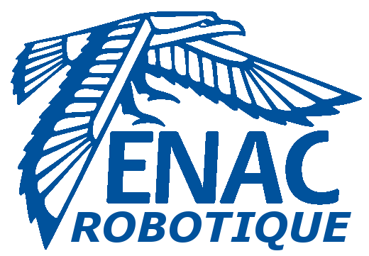

[](https://travis-ci.org/ENACRobotique/doc)
# [La documentation du club robot](https://enacrobotique.github.io/doc/)

# Contribution

Ce répertoire est ouvert à ***TOUTES*** les contributions, alors si tu vois des erreurs, des fautes ou des choses à corriger n'hésite surtout pas et fais un commit. Pour des grandes modifications travaille sur la branche `wip`.

La documentation est automatiquement remise à jour à chaque commit sur la branche master.

Pour prévisualiser ses changements il faut commencer par installer `mdbook`.

Il faut commencer par installer Rust si tu ne l'as pas déjà en suivant les instructions sur la page de [rustup](https://rustup.rs/).

Ensuite, on peut installer `mdbook`. La compilation va prendre du temps, pas d'inquiétude, c'est normal.

```bash
cargo install mdbook
```

On peut maintenant clone le repo :

```bash
git clone https://github.com/ENACRobotique/doc
```

Une fois cloné, il faut lancer mdbook :

```bash
cd doc
mdbook serve
# à remplacer par 'mdbook serve -o&' pour ouvir automatiquement la documentation dans ton navigateur par défaut
```

Et voilà, tu peux te rendre sur [127.0.0.1:3000](http://127.0.0.1:3000) pour voir la documentation en local !

## [Guide pour se servir de mdbook](https://rust-lang-nursery.github.io/mdBook/)

Il est recommandé de lire le [guide de l'utilisateur](https://rust-lang-nursery.github.io/mdBook/) de mdbook avant de faire des changements pour bien comprendre ce que l'on fait.

