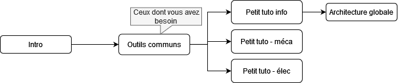

# Introduction

Ce site contient la documentation du club robot de l'ENAC. Il est en cours de construction, donc très incomplet pour l'instant. N'hésites pas [contribuer](https://github.com/ENACRobotique/doc) !

Si vous êtes **nouveau**, jetez un coup d'oeil à **[l'introduction](introductions/tutoriel.md)** pour des tutoriels intéressants à suivre, et posez vos questions sur le [Discord](https://discord.com/invite/7sPZFxb) !

Lorsque vous avez besoin d'aide spécifique sur l'utilisation d'un logiciel, consultez les [Outils Communs](outils-communs/index.md)

On conseille au cours de l'année de lire les **[Retour d'Experience (REX)]() que ce soit sur la conception des robots en début d'année puis sur la coupe pour ne pas répéter les erreurs.

Ensuite, si vous avez besoin de tutos spécifiques sur certains sujets ou des clés pour se lancer, il faut consulter les [petits tutos](petits_tutos/index.md)

<!-- Pour les programmeurs, consulter Tuto Code pour comprendre le principe. -->

<!-- Voici l'ordre de "lecture" du site :  -->
<!--  -->
