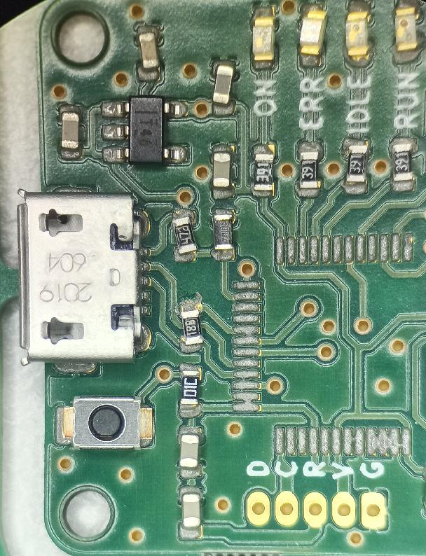

# Tutos elec

L'elec de base ce n'est pas sorcier, mais on peut pas l'inventer ! Alors voilà quelques petits tutos en rapport avec l'elec, notamment des schémas pour les circuits les plus courants.

Commencez donc par [allumer une LED](led.md) !

Pour les débutants complets voici une série de tutoriels non exhaustif d'[éléctronique de base](https://www.youtube.com/playlist?list=PLu-QLFNiuxva1LY5CyBa7UJBZkIh5bi_G) sur youtube. 

