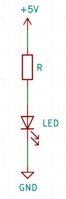

# La LED - Light Emitting Diode

<!-- > **TL;DR;** Prends entre 300 et 400 ohm. -->

La led, c'est la base. Il faut toujours avoir une LED sous la main. Alors commençons direct :
- Le premier "composant" (la flèche vers le haut) représente une source de tension continue (on ne travaille qu'en continu).
- Le 2ème est une résistance
- le 3ème une LED
- le dernier, la masse (point où le potentiel vaut 0V)

Comme au collège, on suppose que le potentiel est constant le long d'un fil.

La LED est un semi-conducteur qui ne laisse passer le courant que dans un sens, de l'anode (le haut dans ce schéma) vers la cathode (le bas).

Elle a une tension de seuil en deçà de laquelle elle ne s'allume pas. __La résistance est absolument nécessaire afin de ne pas griller la LED, où le système qui l'alimente !__

## Calculer la résistance

Pour calculer la résistance, nous devons connaître la tension d'alimentation (ici 5V, nous l'apellerons __Vcc__), la chute de tension aux bornes de la LED __Vd__, et le courant que nous voulons faire passer dans la led __i__.

Admettons pour l'exemple que la chute de tension au borne de la LED soit `Vd=1.6V`, et nous voulons faire passer un courant de `i=10mA`.

- on calcule d'abord la tension au borne de la résistance (loi des mailles): `Vr=Vcc-Vd` (donc ici: Vr=3.4V)
- on calcule ensuite la résistance avec la loi d'ohm (U=RI): `R=Vr/i` (donc ici: R=3.4/0.01, R=340 ohms)

## Déterminer les paramètres

C'est bien tout ça, mais comment on trouve __Vd__ et __i__ ? La réponse se trouve dans un document appelé la __datasheet__.

Ce document existe pour tout les composants électronique, et il faut le consulter avant d'utiliser un composant.

Pour des composants "standards", il n'y aura pas besoin de tout lire, on pourra se concentrer sur quelques infos précises.

Voilà une datasheet pour une LED : [BIR-BM1331](../../datasheets/BIR-BM1331.PDF).

Quelques indices pour lire une datasheet :

- En haut à doite, il y a généralement le nom des composants décrits par la datasheet.
- Ensuite, il y a un desciption synthétique du composant. C'est rapide et facile à lire, et il y a beaucoup d'infos intéressantes, donc c'est à lire !
- Il y a généralement une section "Absolute maximum ratings". Si vous dépassez les valeurs données ici, vous allez à coup sûr griller le composant. Il ne faut __jamais__ atteindre ces valeurs. Cette partie sert à savoir rapidement si le composant peut convenir pour notre cas ou pas.
- Le reste de la datasheet contient toutes les infos nécessaire, c'est là qu'il faudra chercher.

Par exemple ici, dans les Absolute maximum ratings, le premier paramètre est "Reverse voltage => 5V". Ça veut dire que si vous branchez la LED à l'envers sur une alimentation de 5V ou plus, la LED va griller très rapidement.
Plus intéressant pour nous, _Continuous forward current 100mA_. On sait donc qu'il faudra fixer le courant à __moins__ de 100mA.

Pour une LED, on va chercher le courant qu'on va faire passer. C'est pas toujours très clair à trouver, mais ici, un gros indice sont les "test condition" qui prennent `If = 50mA` ou `20mA`. C'est bien inférieur à 100mA, on peut donc choisir 20mA.

Ensuite, il faut touver le _forward voltage_ correspondant à ce courant. On peut le lire, assez difficilement grâce à la figure 3: "_Forward current vs. Forward Voltage_". Pour If=20mA, on trouve environ __Vf=1.2V__.

On peut donc refaire notre calcul de résistance: `R=(5-1.2)/0.02` donc `R=190 Ohm`

