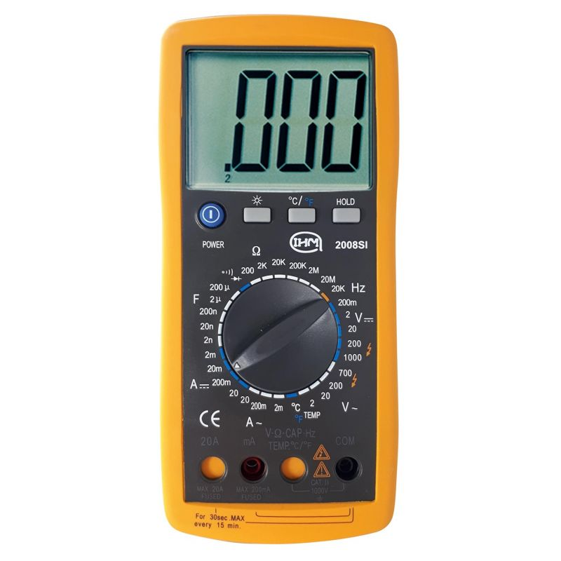
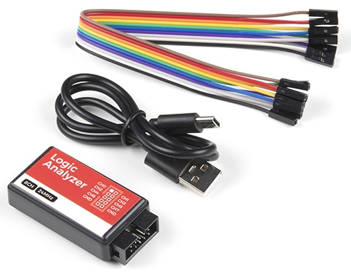

# Identifier un problème dans un circuit

Vous avez monté un circuit et il ne fonctionne pas ? Branché un composant sur un microcontrolleur et copié collé parfaitement le code mais aucune réaction. La dernière fois ça marchait et pas aujourd'hui ? Avant de jetter votre matériel pensez à vérifier l'état de votre circuit ! Pour cela il y 'a plusieurs outils essentiels à savoir utiliser et certaines vérifications à faire.

#### Défaut dans un circuit ou sur une carte

Tout d'abord il vous faut savoir comment utiliser un [Multimètre](https://www.youtube.com/watch?v=-ovWpR5nECA&t=269s).

Pour détecter rapidement un court circuit ou au contraire si le courant ne passe pas ou il devrais, vous pouvez commencer par utiliser le testeur de continuité (icône de diode).

**LES CÂBLES** sont très souvent source de problèmes surtout quand il sont de mauvaise qualité. Le courant ne passe pas ou alors passe mal. C'est souvent à cause de cela que certain composant ne réagissent pas ou ont un comportement irrégulier. Si vous avez des fils serti ou vissé il faut vérifier qu'il ont correctement été monté. 

Une autre chose est de vérifier si il y'a des défaut mécaniques sur la carte. Des soudures ont peut être cédée suite à des chocs. Par exemples les bornier d'alimentations peuvent facilement être arraché lorsqu'on les vis et qu'on applique trop de force.

Votre microcontrolleur peut être endomagé. Vous pouvez vérifier si les broches fonctionnent en regardant si les changement de tensions suivent un signal que vous attendez ou en utilisant le testeur de continuité.

Un exemple: 

En 2024 nous avions branché un driver de stepper à l'envers sur une nucléo l432KC. Le driver à brulé. Après cela nous avions vérifié le circuit qui n'avait pas l'air d'avoir été endomagé. Bien plus tard nous nous étions rendu compte d'une irrégularité dans le contrôle de certain composant. Nous avons donc débugué le code pendant des heures, testé avec plusieurs actionneurs. Et c'est en testant les connections que nous avons remarqué que l'une des pin de la nucléo ne fonctionnait plus. Au final un simple test au multimètre à suffit...

#### Comment débuguer un signal complexe ? 

Dans le cas ou vous voulez faire passer des signaux plus complexe que du tout ou rien un multimètre ne suffit pas. Vous pourriez penser à un osciloscope mais encore vous ne pourrez pas forcément voir ce que vous voulez. C'est là qu'interviens l'annalyseur logique !

C'est un outils qui permet d'analyser des signaux logique et parfois analogiques selon les modèles. On le branche par USB au pc et on utilise un logiciel pour visualiser les signaux qui peuvent être décodé directement. 
Vous pourrez normalement le tester avec la carte tuto.