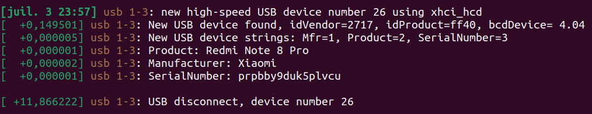
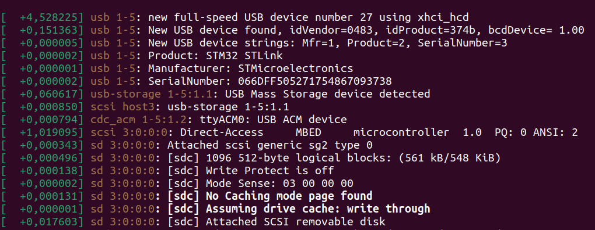

# Commande Bash Utiles

Petite liste non exhaustive de commandes bash et de leur applications. On ne peut pas toujours tout deviner. 

La **première chose à faire** est toujours de taper `man [cmd]` où <<[cmd]>> est le nom de la commande à utiliser. La deuxième chose est d'utiliser internet.

### `dmesg`

L'option `-w` peut être utilisée pour observer les connexions et déconnexions de périphérique en temps réel et l'option `-e` permet rendre tout ça lisible. Par exemple en tapant complètement `sudo dmesg -we`:

On peut voir qu'a 23h57 un périphérique USB à été branché. On à l'information de quel USB il s'agit Il s'agit d'un Smartphone model Redmi Note 8 Pro du constructeur Xiami. On à même le numéro de série et on est donc capable de l'identifier de façon unique. En regardant sur internet je vois qu'il s'agit d'un téléphone. En effet j'avais besoin de transférer queslques photos ! On peut voir qu'il a été débranché 11 secondes plus tard. 

Ensuite 4 secondes plus tard : 

Le début est similaire mais cette fois pas de mystère, nous avons branché une de nos [carte tuto](../../carte_tuto/tuto_board.md) pour la programmer. Or nous cherchons ici à faire de la communications en UART avec elle mais nous ne trouvons pas sur quel port addresser la liaison. Bien sûr nous avons déjà cherché dans le `/dev` mais il y'a tellement de périphérique qu'on ne s'y retrouve plus. Heureusement il y'a cette ligne :

 `[  +0,000679] cdc_acm 1-5:1.2: ttyACM0: USB ACM device`

Qui nous indique que le périphérique est bien sur le `/dev`, plus précisément sur `/dev/ttyACM0`. 

Pour aller plus loin on peut utiliser `udevadm info -a /dev/ttyACM0`. On ne va pas le montrer car c'est une pluie d'informations mais qui peut néanmoins se montrer utile en fonction du besoin. 

