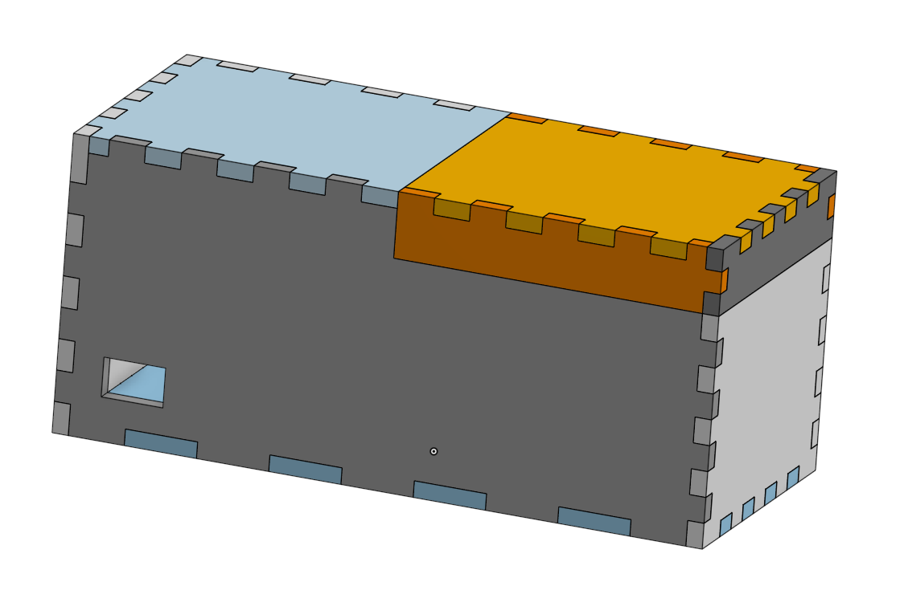
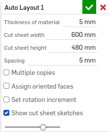
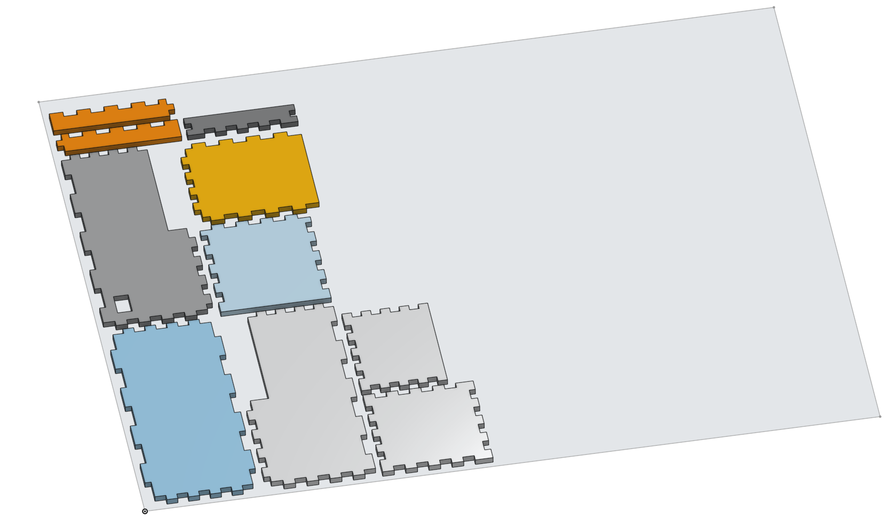
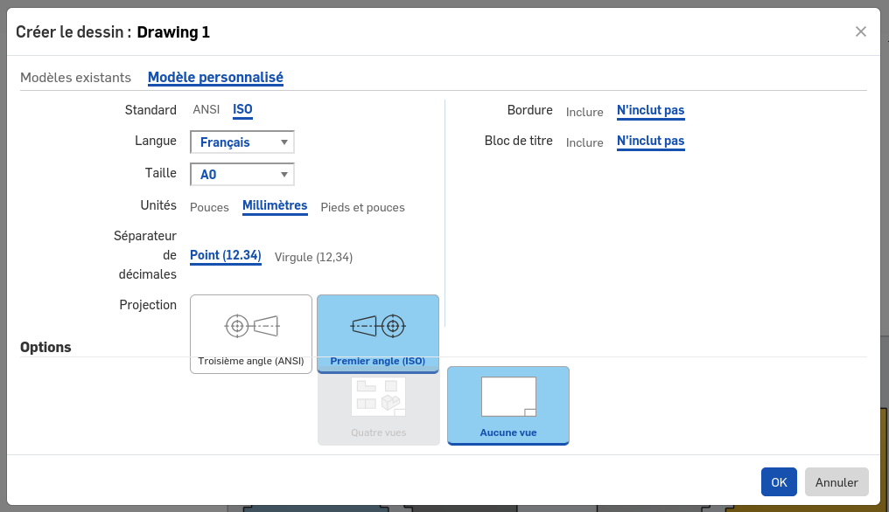
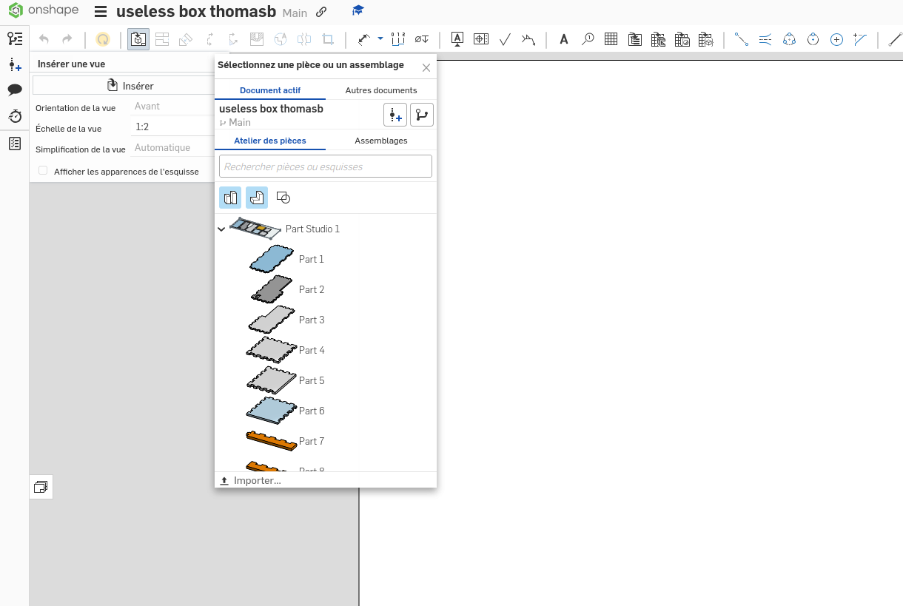

# Découpe Laser

## Préparer un fichier de découpe avec inkscape
+ vectoriser une image ? 

## Préparer un fichier de découpe avec onshape
Prenons l'exemple de cette useless box dont on aimerait découper les différents pièces :

    

Pour pouvoir la découper, il faut passer d'un fichier 3d à 2d. Pour cela, nous utiliserons la feature Auto Layout.

Voici à quoi ressemble le menu lorsque que l'on clique sur l'icône.

    

- **Thickness of material** correspond à la finesse du bois que l'on souhaite utilser
- **Cut sheet width & Cut sheet height** correspond à la longueur et à largeur de la planche de bois.
- **Spacing** correspond à l'espace minimal entre 2 pièces
- **Mutlitple copies** permet de mettre plusieurs fois le projet que l'on souhaite découper (pratique si on veut faire la même découpe plusieurs fois sur la même planche)
- **Assign oriented faces** permet de forcer le sens de la pièce en mettant la face selection sur le dessus
- **Show cut sheet on sketches** permet de voir l'esquisse de la taille de la planche

Avec les paramètres de la photo précédente, on obtient :

    

Maintenant que nous avons nos pièces à plat, on va pouvoir créer le modèle 2D. Pour cela nous allons créer un nouveau dessin avec les paramètres suivant :

    

Et ensuite on ajoute notre atelier de pièces en cliquant sur :  
insérer une vue -> inserer -> document actif -> atelier de pièces -> notre atelier de pièce (ici Part Studio 1).  
Après avoir cliqué sur notre pièce, il faut penser à changer l'orientation de la vue par "dessus" avant de la poser sur le dessin

    

Il ne reste plus qu'à l'exporter au format dxf en faisant un clique droit sur l'onglet du dessin (les différents onglets sont affichés tout en bas).

## Découpeuse du club 
Le club possède une découpeuse laser depuis la rentrée 2024 nous n'avons donc encore rien documenté. Tu sera peut-être celui qui écrira cette section qui sait :) ?

