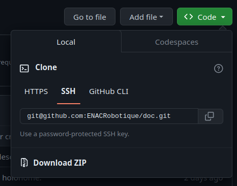

# Git

Git est un gestionnaire de version qu'on utilise pour gérer le code. Il permet entre autres de facilement collaborer à plusieurs sur un même code, ou encore de revenir à une version antérieur d'un fichier.

## Mise en place
- se créer un compte sur [Github](https://github.com)
- donner son nom d'utilisateur à un responsable du club afin qu'il vous ajoute à l'organisation [ENACRobotique](https://github.com/ENACRobotique)
- installer git : 
  - Linux : `sudo apt install git`
  - [Windows](https://git-scm.com/download/win)
  - [MacOS](https://git-scm.com/download/mac)

- configurer son email et son nom :
  - `git config --global user.name "Michel"`
  - `git config --global user.email "michel.du@pont.fr"`

Afin de faciliter l'utilisation de github, il est conseillé de créer une paire de clés SSH et de d'ajouter la clé publique à votre compte github. Cela permettra de pusher vos modif sans taper votre login/mot de passe à chaque fois :
- créer un paire de clés :
  - ouvrir un terminal et lancer `ssh-keygen`
  - Garder le chemin par défaut
  - Ne pas mettre de passphrase pour n'avoir rien à taper lors d'un push 
  (faites "Entrée" plusieur fois sans rien taper).
  - Vous pouvez visualiser la clé avec `cat ~/.ssh/id_rsa.pub`
  certain pourront avoir un autre nom de fichier terminant par .pub

- Ajouter la clé à votre compte github :
  - connectez vous à [Github](https://github.com), et allez dans vos Settings à l'onglet [SSH and GPG keys](https://github.com/settings/keys)
  - Cliquez sur [New SSH key](https://github.com/settings/ssh/new)
  - Entrez un titre pour vous rappeler à quel ordinateur cette clé est liée
  - copiez collez la totalité de votre clé publique (ce qui sort de `cat ~/.ssh/id_rsa.pub`)
  - Cliquez sur New SSH key
  - Confimez votre mot de passe

Vous pourrez maintenant cloner les dépôt github en utilisant SSH plutôt que HTTPS en cliquant sur _Use SSH_ dans la petite fenêtre pour obtenir l'adresse du dépôt.
L'adresse du dépôt devrait ressembler à ça : _git@github.com:ENACRobotique/doc.git_

# Utilisation 

[Lien vers le git de tuto](git@github.com:ENACRobotique/tutogit2020.git)

Vous aurez un cour sur l'utilisation de base de git. Plus que de simple commande il y'a aussi tout un concept à comprendre que vous serez ammené à maitriser avec l'usage. Vous pouvez retrouver un récap des commandes de bases ici : [Git cheat sheet](../../datasheets/git-cheat-sheet-education.pdf)

# Avancé 
[Supprimer des sous modules proprement avec git](https://www.curiouslychase.com/posts/fix-git-submodule-add-a-git-directory-is-found-locally-issue/)

