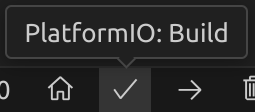
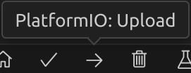
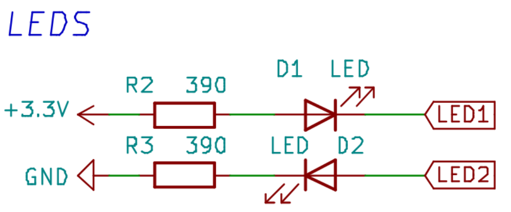
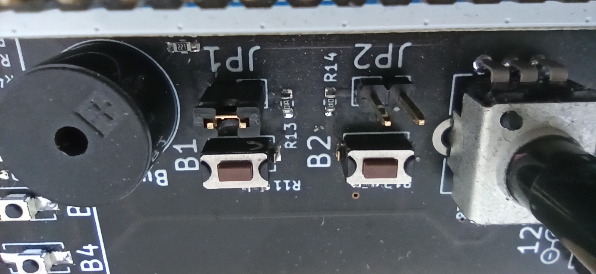
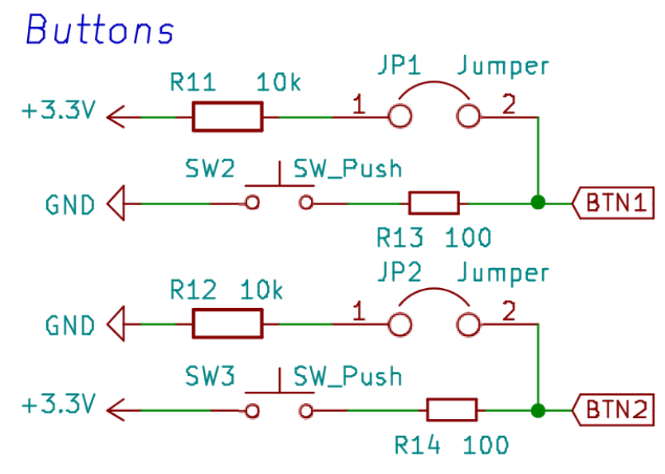

# Les bases

### Led

On va commencer par le “hello world” de la programmation embarquée : faire clignoter une led !

Regardez le [schéma](../../datasheets/tuto_board_schematics.pdf) de la carte tuto : on va faire clignoter la LED2 (qui est dans le cadre “Basics” ), qui est connectée à la broche PC8 du microcontrôleur ( le bloc au centre ).

#### Configuration

La broche doit d’abord être configurée en sortie. Cela permettra ensuite de la mettre à l’état logique haut ou bas, ce qui se traduira par une tension entre GND et la broche de 3.3V ou 0V.
La fonction pour configurer une broche en entrée ou sortie s’appelle pinMode: `void pinMode(int pin, int mode);`
Elle prend en premier argument la broche à configurer, en en deuxième argument le mode. Les deux modes principaux sont INPUT et OUTPUT. Il en existe d'autres que nous verront plus tard.

On va donc configurer la broche comme ceci, dans la fonction setup:
```cpp
void setup() {
  pinMode(PC8, OUTPUT);
}
```

#### Commander l’état

On va ensuite changer l’état de la broche grâce à la fonction digitalWrite: `void digitalWrite(int pin, int val);`
Elle prend en premier argument la broche, et en deuxième l’état à écrire : HIGH ou LOW.
On va aussi utiliser la fonction `delay` qui met le programme en pause durant un certain temps (en millisecondes).

On écrira donc dans la fonction loop:

```cpp
void loop() {
  digitalWrite(PC8, HIGH);	// set PC8 to HIGH
  delay(500);			// wait 0.5 seconds
  digitalWrite(PC8, LOW);	// set PC8 to LOW
  delay(500);			// wait 0.5 seconds.
}
```
Compiler (Build), puis flasher (Upload) le microcontrôleur grâce à ces deux boutons (en bas de l'application):


<div style="display: flex; justify-content: center; gap: 100px;">
  
  
</div>


Un terminal devrait s'ouvrir, il faut attendre. La première fois cela peut être plus long car VS code peut vouloir installer des outils suplémentaire. Vous devriez voir le message suivant :

```==== [SUCCESS] Took 14.34 seconds ====```

La LED2 doit donc maintenant clignoter.

> Note : Il est possible que vous aillez une erreur de televersement à ce moment, surtout si c'est la première fois. Consulter la section [VS Code & Platformio](../../bases/info/vscode.md) peut vous aider.


Changez le programme pour la faire clignoter plus vite, ou de manière asymétrique: des flash bref séparés par un temps assez long.

#### Améliorer son code

On se réfère toujours à la broche par son nom: `PC8`. Ce n’est pas très explicite. On va donc faire ce qui s'appelle un `define`.
Ajoutez cette ligne au dessus de la fonction setup : `#define LED2 PC8`

C’est une directive de préprocesseur, qui sera appliquée avant la compilation et qui va remplacer toutes les occurrences de `LED2` trouvées dans le code par `PC8`.
Cela nous permet donc d’écrire un code plus explicite. Vous pouvez donc écrire `LED2` à la place de `PC8` dans tous les appels de fonctions.

Vous pourrez remarquer au passage que HIGH et LOW ne sont que des `define` pour 1 et 0.

> Note:
En C, une expression booléenne est vraie tant qu’elle est différente de 0.
Vous pouvez remplacer HIGH et LOW par un entier dans la fonction `digitalWrite`, ça marchera toujours.

#### Une autre led

Tout en gardant votre code, faites clignoter la LED1  (PB1) au même rythme.
Qu'observez-vous ?
La LED1 est dans l’état opposé à la LED2. Observez le [schéma](../../datasheets/tuto_board_schematics.pdf) électronique pour comprendre pourquoi.

Faites les clignoter de la même manière.




> Note:
On peut régulièrement trouver les deux manières de brancher une led.
La LED2 est branchée d’une manière plus “logique”, mais il est parfois conseillé de brancher les leds comme la LED1. Les circuits intégrés reçoivent (sink) plus facilement du courant qu’ils n’en fournissent (source).


### Boutons

On a appris à configurer une broche en sortie pour écrire son état, on va maintenant faire l’inverse: lire l’état d’une broche.

> Note: Avant de commencer, assurez-vous que les jumpers JP1 et JP2 sont montés. On verra plus tard à quoi ils servent.

<div style="display: flex; align-items: flex-start;">

<div style="padding-left: 30px;">

On peut brancher facilement les jumpers avec des petits connecteur. À gauche le jumper JP2 déconnecté à droite le jumper JP1 connecté.

</div></div>

La suite est très similaire à ce que l’on vient de faire : il faut maintenant configurer la pin en entrée (dans la fonction setup): `pinMode(BTN2, INPUT);`.
Puis on va lire l’état de la broche grâce à la fonction digitalRead:
int digitalRead(int pin);
Elle prend en argument la pin à lire, et retourne l’état de cette pin.

On va donc écrire ce code dans la fonction loop pour récupérer l’état du bouton, et allumer une led en conséquence :
```cpp
int etat = digitalRead(BTN2);
digitalWrite(LED2, etat);
delay(10);
```
Compilez, flashez, testez.

Changez le temps du delay pour 1000. Que se passe t’il ?
La led met longtemps à réagir car le programme est en pause, et ne fait un tour de boucle que toutes les secondes !

> À savoir : La fonction `delay` est ce qu'on appelle une fonction "bloquante". Lorsqu'elle est exécuté aucune autre instruction ne sera exécutée. Çela peut être un problème et dans ce cas on cherchera à utiliser des fonctions "non bloquante". Dans le cas présent ce n'est pas très important. On vera cela ultérieurement. 

Remettez un delay raisonnable (moins de 100ms pour que ce soit réactif), et utilisez maintenant BTN1. Que se passe t’il ?
Pourquoi ?

> Note: Dans les schémas suivants, les petites résistances sont des résistances de protection que vous pouvez ignorer. Ignorez donc R13 et R14.


#### Intérêt des pullup et pulldown

Enlevez les jumpers. Est-ce que ça marche toujours aussi bien ? (non). 



Explication : Les résistances R11 et R12 sont ce qu’on appelle des résistances de pullup et de pulldown.

Sans les jumpers, quand le bouton ne fait pas contact, la pin est “en l’air” : elle n’est connectée ni à la masse, ni au 3.3V.

Une broche en entrée est dans un état dit “haute impédance” : le courant d'entrée est très faible (idéalement 0), comme si la broche n’était pas reliée au reste du circuit.

Le potentiel (tension par rapport à la masse) de cette pin est donc indéfini, et va varier au gré des perturbations électromagnétiques environnantes.
C’est donc le rôle des résistances de pullup / pulldown de fixer le potentiel de la broche à une valeur connue.

Prenons le cas de R11, sur BTN1 (le jumper JP1 étant connecté):
Quand le bouton n’est pas pressé,BTN1 est connecté au 3.3V à travers de la résistance R11.Le courant d’entrée du microcontrôleur étant nul, le courant traversant cette résistance vaut donc 0. D’après U=RI, on en déduit donc que la tension aux bornes de R11 est nulle, et donc que le potentiel de BTN1 vaut 3.3V.

Quand le bouton est pressé, si on ignore R13, BNT1 se retrouve donc directement connecté à GND. Le potentiel est donc de 0, et on lira donc un état bas.

La tension aux bornes de R11 sera donc de 3.3V, et on peut déduire le courant qui la traversera par I=U/R. Ici on aura donc I = 3.3/10 000 = 0.33mA.

Une résistance de pullup / pulldown aura souvent un ordre de grandeur d'environ 10KOhm : Cela permet d’avoir une faible consommation d’énergie tout en remplissant parfaitement sa fonction.

##### Mais R13 ? Elle existe en vrai !

Oui, elle existe. On peut calculer gâce à la formule du pont diviseur de tension la tension réelle de BTN1 quand le bouton est pressé:
VBTN1 = (3.3 * R13) / (R13 + R11) = 0.03 V
Cette tension est très proche de 0, bien en dessous du seuil maximal de détection d’un niveau bas.

##### C’est pas un peu trop compliqué pour un bouton ?

Eh oui, c’est la vie.
Mais comme on a très souvent besoin de résistances de pullup ou de pulldown, elles sont déjà intégrées dans le microcontrôleur ! Il suffit de les activer.

Enlevez les jumpers, et modifiez la manière dont sont configuré les broches:

```cpp
pinMode(BTN1, INPUT_PULLUP);
pinMode(BTN2, INPUT_PULLDOWN);
```

Maintenant ça devrait très bien marcher même sans les jumpers !

> Note:
La manière la plus “logique” de connecter le bouton serait la manière dont est branché BTN2. Cependant, dans beaucoup de microcontrôleurs, il n’y a pas de résistance de pulldown, mais seulement des résistances de pullup.
On prend donc l’habitude de connecter les boutons comme BTN1

Remarque:
Les résistances R13 et R14 ne sont pas nécessaires. Il faut cependant faire très attention: imaginons que la broche BTN1 soit configurée en sortie (OUTPUT), et commandée à l’état haut. Appuyer sur le bouton va donc créer un court-circuit entre le 3.3V et la masse au sein même du microcontrôleur, ce qui risque fort de le griller.
Si on garde R13, elle va limiter le courant à I=U/R = 3.3/100 = 33mA, ce que le microcontrôleur est capable de supporter.

### Signaux analogiques(TODO)

+ Lecture d'un potentiomètre 
+ Utiliser le PWM
+ Commander un servo et le clignotement des leds
