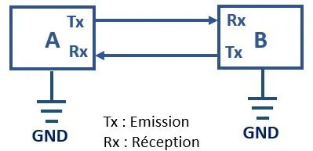
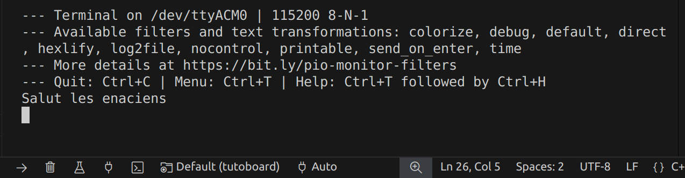

# Les communications


### Introduction au serial

Pour communiquer entre le pc et une carte électronique, un moyen souvent utilisé est la [transmission Série](https://fr.wikipedia.org/wiki/Transmission_s%C3%A9rie) ou Serial. C’est un protocole de communication qui a l’avantage d’être simple et surtout, facilement programmable. Le principe est qu'un seul bus de données relie deux appareils et permet la communication en envoyant un par un les trames de données. **En gros on les relie par un fil...**

#### Communication avec le pc

Comment utiliser le serial pour débugger, sans rentrer du tout dans les détails :

Pour utiliser le serial il faut modifier le fichier `platformio.ini` et y rajouter l'instruction `monitor_speed = baudrate`.


Ensuite pour accéder au moniteur série il suffit de cliquer sur l'icone en bas de l'écran : 


> Si vous faisiez le tuto *Lecture d'un potentiomètre*, pas besoin d'aller plus loin dans l'immédiat. Vous devriez pouvoir lire des messages du moniteur.

Avec maintenant un peu plus de détails : 

La manière la plus courante pour communiquer entre un PC et une carte embarquée est via les ports USB des 2 objets en question.
Ainsi, repérez le port mini usb sur la nucleo, puis branchez y l’adaptateur USB-microUSB jusqu’au PC.
Qu’est-ce qu’il se passe sur le PC ?
Rien d’apparent, mais sous linux, les périphériques sont situés dans le dossier `/dev/tty`.

Dans le terminal faites ``ls /dev/tty*``

Vous devriez avoir avec cette commande plein de résultats. Maintenant débranchez l'usb et refaite la commande. Vous devrier en avoir un de moins. Si vous jouez au 7 différences vous devrier en trouver un du genre `ttyACMX`. Moi par exemple j'ai  `ttyACM0`. C’est notre nucleo ! Ensuite, on utilise la bilbiothèque Arduino qui utilise les standards de `print` du C/C++.

Pour configurer le serial on rajoute dans le setup `Serial.begin(baudrate);`, ou baudrate et le nombre de [BAUD](../../introductions/lexique.md), dans le cas présent cela signifie le nombre de bits par seconde. Ici utilisez la valeur `115200`.

Maintenant pour envoyer un message dans le moniteur série on peut faire `Serial.print("Salut les enaciens !");` dans le setup.

Pour formater un message on à plusieur solutions. 
+ On peut spécifier la Base à utiliser ou l'arrondi pour un nombre par exemple: 
```cpp
Serial.print(78, BIN) donne "1001110"
Serial.print(78, OCT) donne "116"
Serial.print(78, DEC) donne "78"
Serial.print(78, HEX) donne "4E"
Serial.print(1.23456, 0) donne "1"
Serial.print(1.23456, 2) donne "1.23"
Serial.print(1.23456, 4) donne "1.2346"
```

+ On peut mélanger du texte et des nombres avec `printf()`. 

Par exemple pour votre led à la page précédente nous avions fait 

```cpp
Serial.printf("potar = %d, led = %d \n", potar_value, led_value);
```

`%d` sert à signifier qu'un type `int` va venir se mettre là,  puis on le passe en argument c'est `potar_value`. Il faut respecter l'ordre dans lequel on l'écrit. On peut utiliser `%f` pour un float et il en existe d'autres, cherchez **Format Specifiers** sur internet.


### UART

L'Universal Asynchronous Receiver Transmitter ou [UART](https://fr.wikipedia.org/wiki/UART) est un composant matériel qui permet l'échange de données entre deux appareils utilisant le protocole série.

<div style="display: flex; align-items: flex-start;">



<div style="padding-left: 30px;">
L'UART est simple à mettre en œuvre car il ne nécessite que deux fils pour la communication (TX pour transmettre et RX pour recevoir), en plus d'une masse commune (GND). Le TX et RX sont désigné du point de vue de l'appareil. Dans notre pratique il y'a souvent un 4e fil pour l'alimentation.

</div>
</div>

La transmission est **asynchrone** c'est à dire qu'il n'y a pas de signal d'horloge pour synchroniser les messages. Au lieu de cela on utilise un bit de Start et un ou deux bits de Stop pour chaque donnée.
Il ya aussi optionellement un bit de parité utilisé pour la détection d'erreurs placé en amont des bits de stop. La vitesse de transmission est en Baud.


#### Communiquer avec le moniteur série

L'UART est ce qui nous permet de communiquer entre le pc et le microcontrôleur. En fait lorsque vous utilisez le `Serial` avec la carte tuto vous faîtes déjà de l'UART ! Mais maintenant vous voulez aussi aller dans l'autre sens. 
Avant le setup et le loop ajouter `String msg;` c'est la variable qui va stocker notre message. Puis dans le loop :

```cpp
if (Serial.available()) // Vérifie s'il y a des données disponibles
{ 
    msg = Serial.readString();  // lit la valeur qu'on a envoyé et l'enregistre dans la variable msg
    Serial.println(msg);  //Affiche le texte contenu dans msg sur le moniteur
}
```
Accedez au moniteur série et cliquez dans le terminal. Vous pouvez maintenant écrire ici. Le texte ne s'affiche pas quand vous écrivez, mais la réponse de la carte s'affichera.




#### Faire communiquer deux appareils

En pratique vous voudrez surement faire communiquer plusieurs cartes. Dans notre cas, on fait très souvent communiquer une raspberry pi avec une STM32. Dans ce cas il faut donc du code des deux cotés. Pour le coté raspberry vous allez utiliser votre pc et python, ça reviens exactement au même. On ne va pas entrer dans les détails coté python alors copiez collez le code ci dessous. Il faut peut être changer le `/dev/ttyACM0` par celui que vous avez. Vous pourrier avoir besoin de la bibliothèque `pyserial` faite `pip install pyserial` dans votre terminal. Et si vous n'avez pas pip, intstallez pip.

```py
import serial
from time import time
if __name__ == "__main__":
    ser = serial.Serial('/dev/ttyACM0', 115200)  # open serial port
    print(f"\nTutoboard sur le port: {ser.name} vitesse : {ser.baudrate}") # check which port was really used
    i = 0
    add = 1
    t = time()
    while True:
        if i == 9 :
            add = -1
        if i == 0:
            add = 1
        if time() - t > 0.1 : 
            i = i + add
            message = str(i) + "\n" 
            ser.write(bytes(message, "ascii")) # write a string
            t = time()
        msg = ser.read()
        print(f"Je lis : {msg.hex()}\n")
        
        # Si vous utilisez write() dans le bas niveau
        # msg = ser.read()
        # print(f"Je lis : {msg.hex()}\n")

```


Maintenant du coté bas niveau : 

Pour rendre ça un peu plus interactif on va faire clignoter les leds en fonction de ce que nous dis le haut niveau et dire au haut niveau la valeur du potar qui gère l'autre led. 

Il nous faut d'abord un **buffer** c'est à dire un espace mémoire qui va contenir la donnée entrante. Nous allons communiquer des messages au format [ASCII](https://fr.wikipedia.org/wiki/American_Standard_Code_for_Information_Interchange). Chaque caractère est codé sur 7 bits. Ici on s'attend à recevoir 2 octets (ou bytes en anglais), le premier étant un entier entre 0 et 9 et le second `\n`permet d'indiquer la fin du message. En embarqué on est plutôt du genre à vouloir toujours connaître la taille des données que l'on manipule. La mémoire étant limitée on voudrait éviter des dépassements de mémoire (ou Buffer Overflow). On va donc rajouter `#define BUFFER_SIZE 2` au début de notre code. 


On va créer des fonctions. 

+ Pour la récéption :

```cpp
int receive()
{
    if (Serial.available() > 0)  // Vérifie s'il y a des données disponibles
    {
        char buffer[BUFFER_SIZE]; // On crée notre buffer pour stocker la donnée
        Serial.readBytesUntil('\n', buffer, BUFFER_SIZE); // Lit les données jusqu'a \n avec un maximum d'octet dicté par BUFFER_SIZE

        // on converti la chaine de carractère en l'entier équivalent 
        // pour pouvoir faire des opérations Attention ça ne marche pas avec les lettres !
        char *output;
        int val = strtol(buffer, &output, 10); // base décimale
        return val;
    }
  return -1;
}
```

Attention à faire la différence entre le caractère `char` qu'est `'\n'` et la chaine de carractère `"\n"` stocké sous forme de liste de `char`. La fonction peut être placée avant ou après le loop. Si elle est placée après, le compilateur vous dira qu'elle n'existe pas. Il faut alors rajouter `int receive();` en amont. 


+ Envoi d'un message : 

La c'est facile, comme on l'a dit plus tôt il suffit de faire un `print` pour écrire sur le serial. 

```cpp
void send(int val)
{ 
  Serial.println(val);
  delay(100);
  // Serial.write((byte)val); // ne mettez pas print et write en même temps !
}
```
Dans certain cas on peut aussi vouloir envoyer des données binaires, on utilise alors `write`. Par contre il faut changer les deux dernières lignes du code python par : 

```py
msg = ser.read()
print(f"Je lis : {msg.hex()}\n")
```

Votre loop devrait tout simplement ressembler à ça :

```cpp
void loop() {
  
  // On lis le potar, on envoie sa valeur dans le serial et on pilote la led 
  int potar_value = analogRead(POT);
  int led1_value = map(potar_value, 0, 1023, 0, 255);  
  analogWrite(LED1, led1_value);
  send(led1_value);

  // On lit dans le serial la valeur a appliquer à la led
  int msg = receive();
  if (msg!=-1)
  {
    int led2_value = map(msg, 0, 9, 0, 255);
    analogWrite(LED2, led2_value);
  }
}
```

Et voilà vous pouvez téléverser. Ensuite dans votre terminal faîtes `python3 tuto_uart.py` pour lancer le programme python. Vous devriez lire la valeur du potar dans le terminal et voir l'une des led clignoter lentement sur la carte.

> Attention vous ne pourrez pas ouvrir le moniteur série en même temps que le code python tourne. Vous ne pouvez pas accéder deux fois au même port série. Vous risquez d'avoir des instabilités voire directement une erreur.


+ (TODO) Visualiser l'UART sur l'analyseur logique.


### (TODO) I2C 


> Note : Récement il y'a l'emergence de l'I3C un successeur de l'i2C et rétro-compatible avec les matériels I2C. Ça à l'air intéréssant.

+ (TODO) Visualiser les trames sur l'analyseur logique

### Communication avec la attiny 1616 :

<!-- [TODO : mettre un easter egg sur l’attiny] -->

<!-- Explication du code :

Vous recevez des caractères étranges et vides de sens, pourquoi ?

-> Baud rate
Il faut le passer à 57600[ou autre] pour lire ce qu’on a caché dans l’attiny. -->