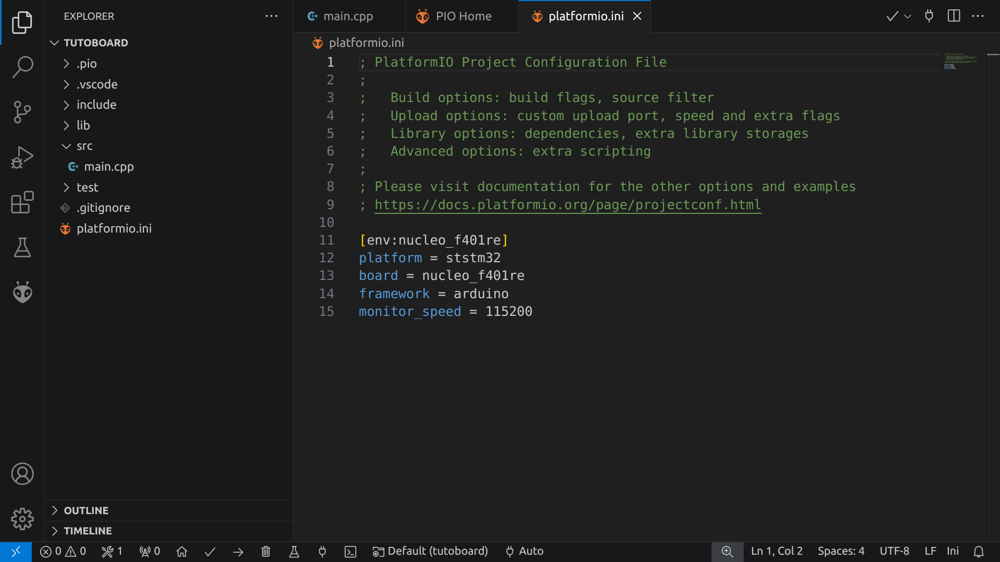
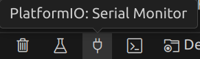

# Les communications

### Introduction au serial

Pour communiquer entre le pc et une carte électronique, un moyen souvent utilisé est la [transmission Série](https://fr.wikipedia.org/wiki/Transmission_s%C3%A9rie) ou Serial. C’est un protocole de communication qui a l’avantage d’être simple et surtout, facilement programmable. Le principe est qu'un seul bus de donnée relie deux appareil et permet la communication en envoyant un par les les trames de données. En gros on les relie par un fils...

#### Communication avec le pc

Comment utiliser le serial pour débugger, sans rentrer du tout dans les détails :

La manière la plus courante pour communiquer entre un PC et une carte embarquée est via les ports USB des 2 objets en question.
Ainsi, repérez le port mini usb sur la nucleo, puis branchez y l’adaptateur USB-microUSB jusqu’au PC.
Qu’est-ce qu’il se passe sur le PC ?
Rien d’apparent, mais sous linux, les périphériques sont situés dans le dossier `/dev/tty`.

Dans le terminal faites ``ls /dev/tty*``

Vous devriez avoir avec cette commande plein de résultats. Maintenant débranchez l'usb et refaite la commande. Vous devrier en avoir un de moins. Si vous jouez au 7 différences vous devrier en trouver un du genre `ttyACMX`. Moi par exemple j'ai  `ttyACM0`. C’est notre nucleo ! Ensuite, étant donné qu’on utilise des librairies arduino, on peut suivre simplement un [tutoriel](https://www.robot-maker.com/ouvrages/tuto-arduino/liaison-serie-com-pc-arduino/) pour utiliser le serial, et communiquer entre les 2 ports USB. On peut suivre le tuto suivant jusqu’à la section :  Utilisons maintenant les variables! 

Attention ce tutoriel utilise l'IDE Arduino mais nous utilisons VS Code. Pour utiliser le serial il faut modifier le fichier `platformio.ini` et y rajouter l'instruction `monitor_speed = baudrate`.

Ensuite pour accéder au moniteur série il suffit de cliquer sur l'icone en bas de l'écran : 

Et ensuite il faut écrire directement dans le terminal du serial. Il n'y a pas zone dédiée.

### UART

[UART](https://fr.wikipedia.org/wiki/UART)

### I2C 
TODO + Note : Récement il y'a l'emergence de l'I3C un successeur de l'i2C et rétro-compatible avec les matériels I2C. Ça à l'air intéréssant.

### Communication avec la attiny 1616 :

<!-- [TODO : mettre un easter egg sur l’attiny] -->

<!-- Explication du code :

Vous recevez des caractères étranges et vides de sens, pourquoi ?

-> Baud rate
Il faut le passer à 57600[ou autre] pour lire ce qu’on a caché dans l’attiny. -->