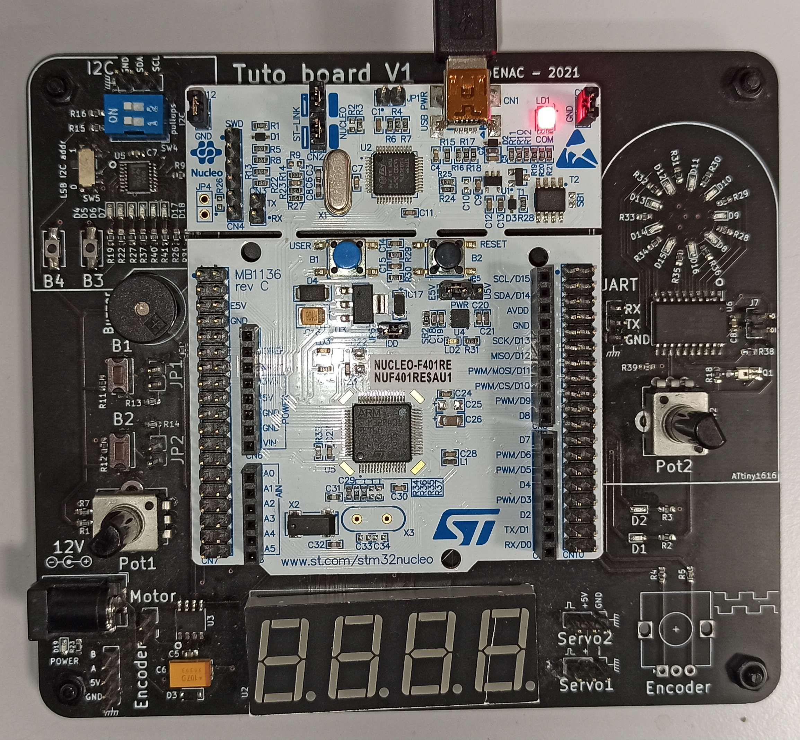
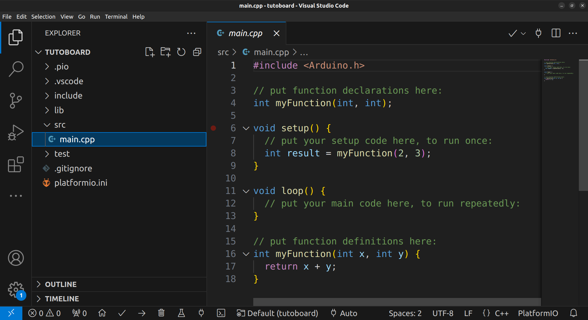

# La tutoboard Enac

# Présentation


Les microcontrôleurs  sont de petits ordinateurs intégrés dans une puce. Ils incluent un processeur, de la mémoire, et des périphériques d’entrées sorties.

Il y en a dans quasiment tous les appareils électriques, du grille-pain à la voiture.
Sur la carte tuto, il y en a deux : un STM32F4, qui est au centre de la Nucleo (la carte blanche), et un ATtiny1616, à droite de la Nucleo, sous le rond de LEDs.
Il y en a même un autre sur la Nucleo, en bas à gauche de la prise USB, qui va servir à programmer le STM32F4.

Ils exécutent un seul programme, qui démarre dès la mise sous tension.

La tuto board est un outils d'apprentissage crée par et pour le club. Vous pouve consulter le projet sur Github: [Git de la tuto board](https://github.com/Fabien-B/tutosBoardRoboticClub/)

<div style="display: flex; align-items: flex-start;">



<div style="padding-left: 30px;">

Le but de cette carte est de pouvoir apprendre tout les concepts de bases de l'utilisation des microcontrolleurs tout en sachant ou commencer. Le club dispense généralement un cour en format travaux pratique sur cette carte. Ce cours peut aussi être réalisé depuis chez sois car le matériel est assez compact pour être emporté ( mais la carte s'appelle reviens ) et le cours est documenté dans les section qui suivent.

</div>

</div>


## Les périphériques
Les périphériques sont des circuits électroniques dédiés à certaines tâches, et sont connectés au CPU (processeur) pour interagir avec le programme.

Quelques périphériques ([Lexique](../../introductions/lexique.md)): 
+ GPIO : general purpose input output. permet de commander des broches en sorties, ou de lire des broches en entrées
+ ADC : analog to digital converter. Permet de de lire une tension analogique.
+ UART : protocole de communication simple
+ I2C : protocole de communication un peu plus complexe
+ Timers : des compteurs qui permettent de faire plein de trucs utiles avec le temps, comme par exemple du PWM (on verra ce que c’est plus tard)

Ces périphériques sont connectés à certaines broches du microcontrôleur. On devra donc choisir quelles broches utiliser suivant ce que l’on veut faire. 

## Arduino

Pour citer wikipédia :

<div style="display: flex; align-items: flex-start;">
<a href="
https://www.arduino.cc/" >
 </a>
<div style="padding-left: 30px;">

> Arduino est la marque d'une plateforme de prototypage open-source qui permet aux utilisateurs de créer des objets électroniques interactifs à partir de cartes électroniques matériellement libres sur lesquelles se trouve un microcontrôleur.

</div>
</div>


Dans notre cas, on va surtout utiliser les librairies arduino, qui vont nous permettre de programmer très simplement le microcontrôleur. Vous pouvez retrouver les références du language dans la [Documentation Arduino](https://docs.arduino.cc/language-reference/).

> Note:
Attention cependant : cette librairie nous cache beaucoup de complexité, on peut donc être surpris par un comportement “bizarre” lorsqu'on utilise beaucoup de fonctions sur beaucoup de broches simultanément.
Exemple vécu l’année dernière : les moteurs qui font un bruit chelou quand on essaie d’utiliser des servos.

## Préparons nous
Pour ces tutos, on va utiliser VSCode avec l’extension PlatformIO, qui va nous permettre d’installer très facilement tout ce qui est nécessaire pour programmer le microcontrôleur.

[VSCode](../../bases/info/vscode.md)


Pour commencer, créez un nouveu projet PlatformIO (icone d'alien dans le menu à gauche). Choisissez la carte correspondante à celle que vous utilisez (Nucleo F401RE par exemple), et avec le framework Arduino.


Dans un projet arduino, il y a toujours deux fonctions qui sont créées par defaut: setup et loop.
La fonction setup sera exécutée une seule fois au démarrage du programme, et la fonction loop sera appelée en boucle. Voici ce que vous devriez voir :



Vous pouvez effacer les deux `myFunction` qui ne seront pas utiles.

Note:
En réalité, la fonction main du programme est codée comme ceci:

```
int main(){
    setup();
    for(;;) {
        loop();
    }
}
```

Le `for(;;)` étant juste une autre manière d’écrire `while(true)` en se la pétant et en économisant 4 caractères.


