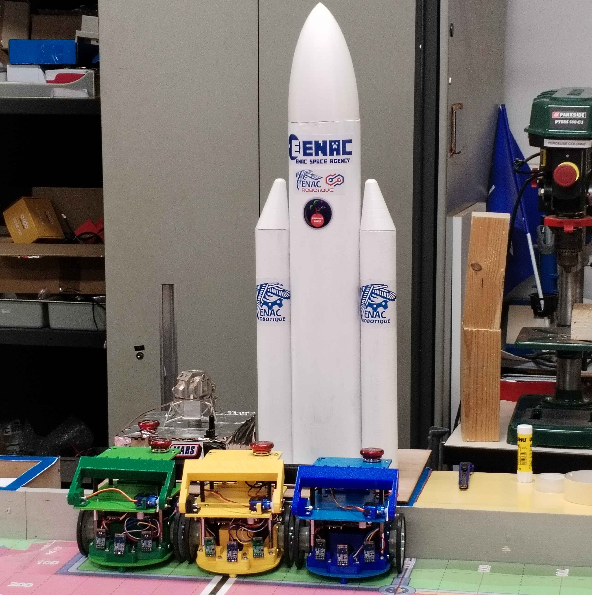

# Tuto PAMI
# Qu'est ce qu'un PAMI ?

**PAMI** est l'acronyme de **Petit Automate Motorisé Indépendant**. Ces robots, plus petits que le robot principal, sont conçus pour être plus accessibles, ce qui en fait un excellent point de départ pour commencer. Leur rôle est crucial pour maximiser les points lors de la Coupe de Robotique, il est donc essentiel d'avoir une bonne compréhension de leur fonctionnement.

Voici les trois PAMIS positionnés au pied de la fusée de l'ESA (ENAC Space Agency), spécialement conçus pour la Coupe de France de Robotique 2024.

    

