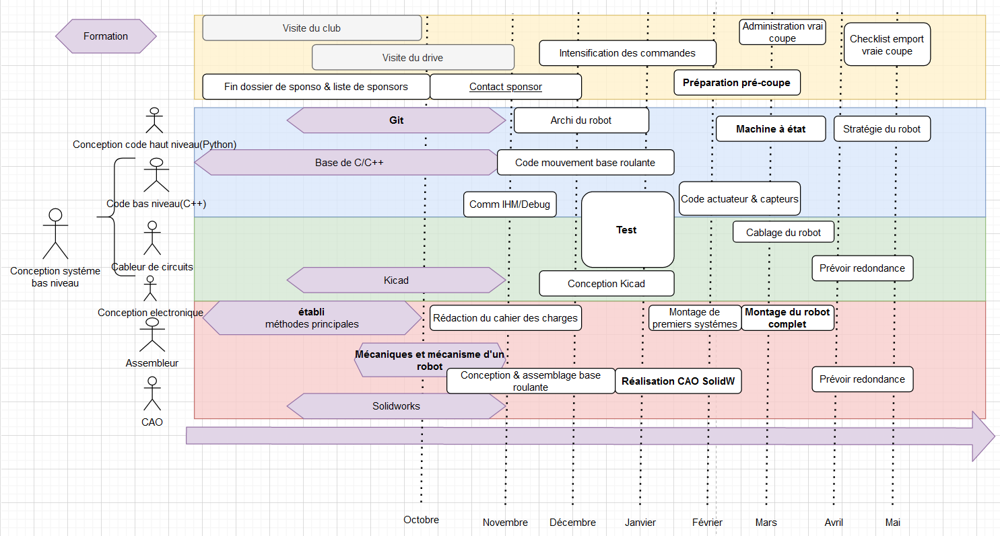

# Introduction d'un robot

## De quoi est constitué un robot ?

### Base roulante

### Base mécanique

### Capteurs

#### Localisation

### Actionneurs

### Microcontrolleur

### Carte electronique

### Ordinateur

## Comment réaliser un robot ?

Tout d'abord, il faut décider de quoi faire -> Il faut rédiger une sorte de cahier des charges.

Ensuite, il faut réunir la liste du matériel nécessaire, lesquels sont à commander par exemple.

Enfin, il faut établir la gestion du projet, c'est à dire savoir qui fait quoi et à quel moment pour ne pénaliser personne dans son travail, c'est à dire décider d'un **calendrier** de formation, de deadlines,...
Des exemples de timeline pour l'année sont sur le guide du nouvel arrivant, [ici](https://drive.google.com/drive/u/1/folders/0B3TOHzAm3I1Sfk96R0xRZGctR3BGa242aGExelpXU2VCcnJmbjg1OVlMRVNyV0xJeTM5SVU?resourcekey=0-rhd8NIuvxKy_Zvdg25Wu4w).

Ainsi, en ordre d'idée, il faudrait idéalement que le robot roule déjà dès fin décembre, et qu'il est capable de marquer des points en février.
Par exemple celui-ci : 

