# Introduction d'un robot

## Comment réaliser un robot ?

Tout d'abord, il faut décider de quoi faire -> Il faut rédiger une sorte de cahier des charges.

Ensuite, il faut réunir la liste du matériel nécessaire, lesquels sont à commander par exemple.

Enfin, il faut établir la gestion du projet, c'est à dire savoir qui fait quoi et à quel moment pour ne pénaliser personne dans son travail, c'est à dire décider d'un **calendrier** de formation, de deadlines,...
Des exemples de timeline pour l'année sont sur le guide du nouvel arrivant, [ici](https://drive.google.com/drive/u/1/folders/0B3TOHzAm3I1Sfk96R0xRZGctR3BGa242aGExelpXU2VCcnJmbjg1OVlMRVNyV0xJeTM5SVU?resourcekey=0-rhd8NIuvxKy_Zvdg25Wu4w).

Ainsi, en ordre d'idée, il faudrait idéalement que le robot roule déjà dès fin décembre, et qu'il est capable de marquer des points en février.
Par exemple celui-ci : 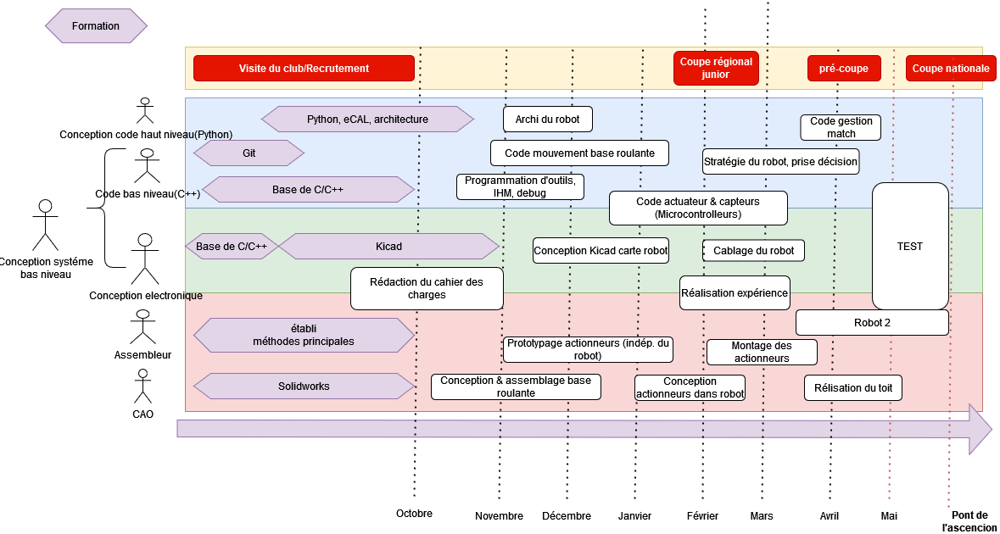

### Le cahier des charges

Pour que tout le monde soit d'accord, il est impératif d'avoir un cahier des charges. Il peut être assez court (quelques pages avec photos), mais il doit contenir l'essentiel, c'est à dire identifier à partir du réglement des "fonctions" à réaliser (se déplacer, récupérer X objet, afficher le score,...) afin que tous les membres aient la même idée des objectifs à atteindre. 
Pour chaque fonction, il faut des critères avec une valeur de performance à atteindre. Il peut bien évidemment être modifié au cours de l'année.

[**Exemple de rapport avec cahier de charges** pour le mini robot de formation Juin 2022](https://docs.google.com/document/d/1mrJBK6TYmAEOajHTTRQV775p3FRSDmuo/edit?usp=sharing&ouid=110371115636606943160&rtpof=true&sd=true)

#### Exemple : 
| Fonction   |      Critère      |  Niveau |
|----------|:-------------:|------:|
|Se déplacer | Vitesse max | 0.8 m/s |
|| précision |  +- 2 cm |
|| Accélération min |  0.3 m.s² |
|| Vitesse angulaire max | 1 rad/s|

### Les specs du robots
L'idée est de recenser toutes les **piéces que composera le robot** (même ceux imprimés en 3D), et d'indiquer l'état d'avancement (en cours de design/de commande, en cours de test,...). Pour ceux qui sont à commander, c'est le moment de voir le prix pour avoir une idée du budget du robot.
Ensuite, on peut faire l'inventaire de ce qui est nécessaire pour la **carte électronique**.
Enfin, on peut définir comment fonctionnera le code dans les grandes lignes (quel "language" de communication entre la carte électronique et les ordis, quels fonctionalités sont impératives, lesquelles sont facultatives,...").

[Un exemple de "cahier de specs" (2022)](https://docs.google.com/document/d/1sOBxRK2LiSuNzQPDihp1MDDo0q5jfXRSP5_wCl4TWog/edit?usp=sharing) 
## De quoi est constitué un robot ?

[Pour des tutos plus approfondis, cliquez ici (VRAC)](https://github.com/VRAC-team/la-maxi-liste-ressources-eurobot#223-moteurs)

### Base roulante

La base roulante est tout ce qui permet au robot de "rouler" sur la table. Cela inclut les moteurs, les roues, les capteurs pour se localiser, l'électronique pour le déplacement et la localisation *(à l'ENAC généralement une carte électronique assure tout le robot)*, et les batteries. 
C'est la partie essentielle du robot, à réaliser en premier. Sans base roulante fiable, on ne peut rien faire.

#### Les robots différentiels 

Le principe de ces robots est d'avoir 2 roues (généralement centrés sur le robot), avec généralement des patins à l'avant et à l'arrière pour que le robot ne bascule pas. On envoie des consignes de vitesse individuelles à chaque moteur ce qui permet de tourner sur soit même, d'avancer, ou de faire des trajectoires courbées : 

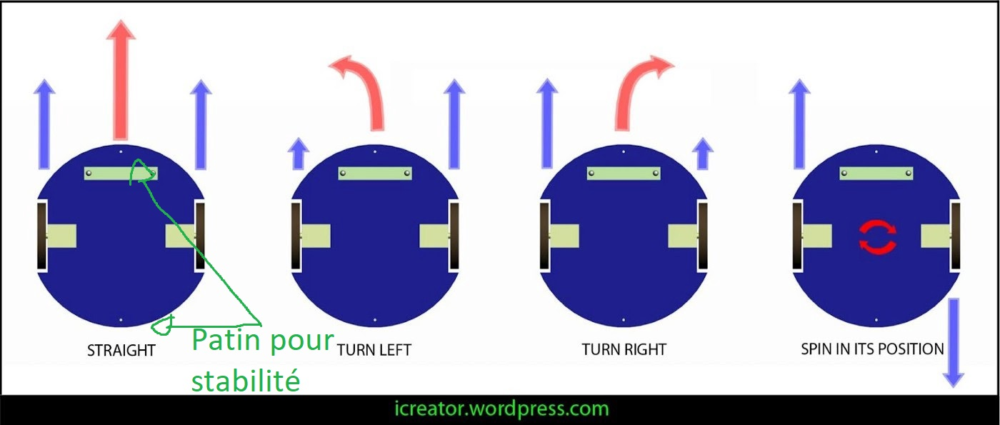

#### Les robots omnidirectionnels :
Ceux-ci ont la faculté de se déplacer dans **toutes les directions** grâce à la forme spéciale des roues. 
Un exemple de gif pour un avec 4 roues : 

On peut également en retrouver à 3 roues, généralement pour faire des robots triangulaires. Le seul désavantage des 3 roues est qu'il n'est pas capable de passer par dessus un obstacle, contrairement à celui à 4 roues qui pourrait.
Pour tourner sur lui même, il suffit de faire tourner les 3 roues dans un sens, et pour se déplacer dans une des trois directions, il suffit de faire avancer 2 roues adjacentes (la troisième roue roule "latéralement" => Pas de frottement )
Le désavantage des robots omnidirectionnels est qu'il est plus compliqué de se repérer dans l'espace avec ceux-là *(à voir partie localisation)*.
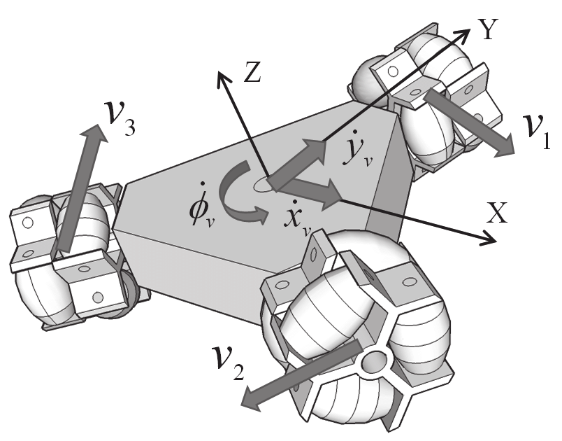

#### La motorisation

Des moteurs électriques, assez basique, ~12-18V, 10W grand maximum. Vérifier le couple avec le rayon des roues, le reste au pifomètre.
[Des outils pour calculer éventuellement le dimensionnement & les caractéristiques du moteur](https://github.com/VRAC-team/la-maxi-liste-ressources-eurobot#223-moteurs)

#### Les roues

On retrouve principalement :
+ Des roues en caoutchouc  (classique)
+ Des roues déjà faites plus exotiques (par exemple des roues de rollers) -> Peuvent endommager la table
+ Faire les roues soit même en polyuréthane, avec l'intérieur de la roue en impression 3D. L'avantage est que l'on peut dimensionner la roue comme on a besoin, ça accroche mieux que la caoutchouc à la table, et ça ne fait (quasiment) pas de dégats sur la table en cas de dérapage. Parcontre il faut le mouler. **Exemple de roues en 2022 sur le dropbox** 
["Tutoriel pour réaliser les roues"](https://www.youtube.com/watch?v=U-_xxI6qvlg)
### Base mécanique

#### Forme du robot 

On retrouve principalement 4 formes possibles :
- Carrées/Rectangulaire
    + **++** Pratique pour se coller à un "mur" 
    + **--** Peu optimal pour l'utilisation du périmètre
    + **--** Peut facilement rentrer en collision avec quelque chose en tournant sur lui même (difficile de tourner sur lui même près d'un mur)
    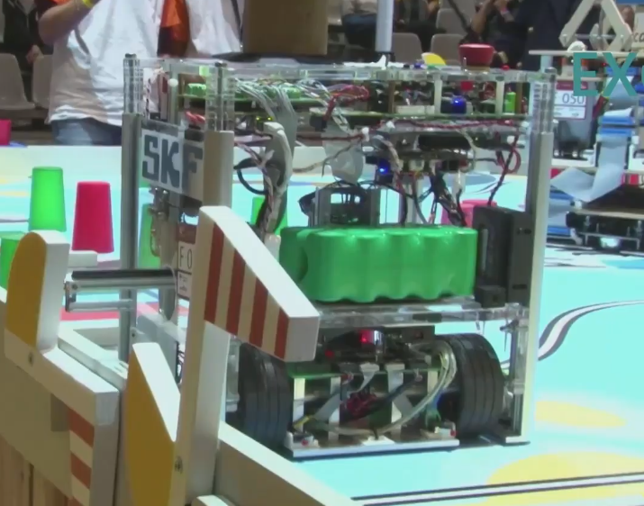
- Cylindrique
    + **++** Pour le périmètre
    + **--** Peu optimal par rapport à ce qu'on utilise : les actionneurs, les piéces mécaniques, etc... sont généralement rectangulaire
    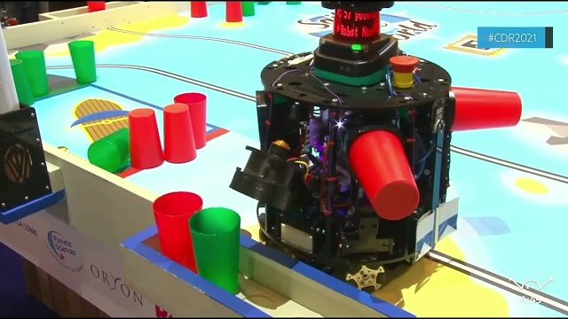
-   Hexagonal (is Bestagon)
    + **+** Pour le périmètre
    + **+** Bon compris entre cylindre et rectangulaire pour le placement des objets à l'intérieur.
    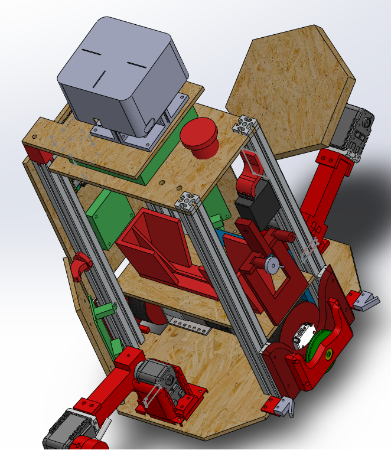
-   Triangulaire
    + **++** pour les robots holonomes à 3 roues

#### Techniques de construction

Pour construire mécaniquement le "cadre" du robot, une méthode que l'on utilise souvent au club robot est de mettre une planche à la base du robot avec les roues, 4 profilés (=poutres) en métal et une planche qui fait le "toit". Entre les deux, on peut mettre des planches verticalement ou horizontalement vissés aux profilés.

Pour les profilés : 
+ Profilés 20*20, M5, Ecrou en T
+ Makerbeam
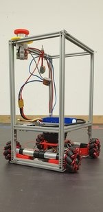

Pour les planches : 
+ **Planches en bois**
+ Verre acrylique
+ en métal

### Capteurs

Pour mesurer certaines choses, on peut utiliser :

Capteur | Usages |
------- | ------ |
Pression | Pour les systèmes pneumatiques (Ventouses) -> savoir si on a attrapé quelque chose
Tension  | Pour le niveau de charge des batteries, mesurer la valeur d'une résistance, ...
Distance TOF (Time Of Flight)/Ultrason | Permet de mesurer une distance entre le capteur et autre chose en face du capteur, en mesurant le temps que met un rayon laser à se réfléchir pour les TOF ou les ondes sonores pour l'ultrason. On peut utiliser cela pour savoir si on a attrapé un objet par exemple, si il est bien présent, pour savoir s'il y a un autre robot, ... Généralement (mais ça dépend des modèles) ils sont assez précis (1-10mm près) qu'à partir d'une distance de 1-2 cm jusqu'à 1m.
Couleur (ex : TCS34725) |  Pour déterminer une couleur. Ne marche qu'à distance très faible (<1 cm), et il y a une led blanche intégrée pour l'éclairer.
Caméra  |  Pour faire de la vision par ordinateur -> Déterminer la position d'un objet, déterminer sa couleur, ... Mais c'est super complexe à mettre en oeuvre donc qu'en dernier recours.
Température  | Pas d'utilité pour la coupe de robot pour l'instant mais ça existe.
Récepteur infrarouge, radio | utilisable pour la communication sans fil (entre robots)
Interrupteur | Permet de détecter si le robot ou autre chose est en "contact" physique. Par exemple, on peut en mettre sur le robot à "l'avant" pour savoir s'il est en contact avec le mur et donc si c'est le cas, on sait que la position du robot est contre un mur et on peut "recaler" sa position ainsi.

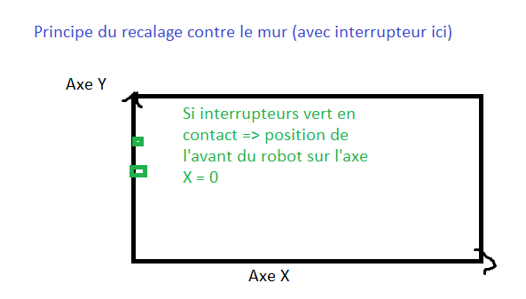

#### Localisation
Capteurs localisation (exemples) | usages
---------------------  | --------
Encodeur optique (AMT-102V) | Surtout pour les robots différentiels. Ce sont des dispositifs qu'on met autour d'un axe (par exemple une roue) pour mesurer le nombre de "tours de la roue". En connaissant le diamètre de la roue, on peut connaitre sa distance parcourue. Certains sont déjà intégrés aux moteurs, mais le problème est que si les roues "dérapent", les encodeurs sur le moteur ne sont pas en mesure de le détecter. On retrouve donc dans certains robots des [roues "folles"](https://enacrobotique.github.io/doc/rex/concept_meca.html#encodeurs), qui sont juste sur un axe avec une faible résistance pour mesurer les déplacements d'un robot. 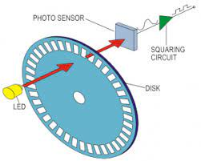
Capteur optique (Souris, [PAA5100JE](https://shop.pimoroni.com/products/paa5100je-optical-tracking-spi-breakout?variant=39315330170963)) | Placé à distance constante du sol, il filme continuellement le sol et via des algorithmes il détermine le "déplacement" horizontal du robot en déterminant les différences entre les images filmés. La précision n'a pas encore été testé au club robot ENAC mais d'après d'autres clubs, c'est prometteur.
Lidar (2D)(Lidar LD06) | Le lidar est un capteur laser qui mesure sur un angle important (généralement 360°) les distances périodiquement(~10hz). L'usage principale est de détecter les adversaires ainsi. Un projet testé pour la coupe 2022 était de repérer des points fixes connus sur le terrain, et ainsi de trianguler la position du robot. Sinon on pourrait aussi le mettre proche du sol pour détecter les murets et certains algorithmes sont capable de déterminer les déplacements de cette manière. Pour info, ça existe aussi en 3D mais ça sert à rien pour la coupe et ça coute une blinde. 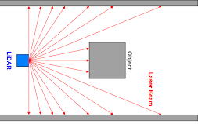
IMU/Centrale inertielle/Accéléromètres | Pas testé au club robot, une centrale inertielle est un instrument, capable d'intégrer les mouvements d'un mobile pour estimer son orientation, sa vitesse linéaire et sa position. L'estimation de position est relative au point de départ ou au dernier point de recalage.
Vision par ordinateur (Camera/Code Aruco) | Les codes Aruco sont les sortes de QR code sur le terrain. Des algorithmes sont capables de déterminer avec une caméra leurs positions dans l'espace et donc si on en met un sur le robot, de déterminer la position du robot par rapport aux codes arucos du terrain. mais c'est complexe à mettre en oeuvre également.
Triangulisation | Ultrason, Infrarouge Sur les balises fixes, on peut mettre des capteurs/Emetteurs ultrason/Infrarouges et sur le robot, on peut se trianguler.

### Actionneurs

A la base de chaque "mouvement" de robot, on retrouve un moteur (mouvement de rotation). Lorsqu'on a besoin de faire certains types de mouvements, il faut faire des [Transformations](https://www.alloprof.qc.ca/fr/eleves/bv/sciences/les-mecanismes-de-transformation-du-mouvement-s1437)

Pour attraper les objets, on peut réaliser des "bras" avec un servomoteur qui déplace le bras, et au bout on peut retrouver des :
+ Pince
+ Ventouse (pneumatique, électrovanne)
+ Pousser directement avec l'actionneur

### Microcontrolleur

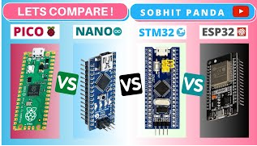

Pin disponible -> Permet de brancher plus de capteurs, actionneurs, et toute sorte de composants électroniques. 

Microcontrolleur | Capacité de calcul/RAM/Espace | Pin disponible | Réseau | prix(hors pénurie)
---------- | ------------ | ------- |------------------ | ----
**STM32 (français)** | Moyen à fort | Moyen à fort (~30-60) | Pas de réseau | Pas cher
**ESP32 (chinois)** | fort à très "fort" | ~20-30 | Wifi, bluetooth | Pas cher
**Arduino** (UK) | Faible | ~10-20 | Pas de réseau | Très cher (pour les capacités)
**Teensy** (USA) | Moyen à fort | Moyen à fort (~30-60) | Pas de réseau | Cher

Au niveau de la programmation, généralement, plus c'est simple à programmer, moins il y a de "flexibilité" pour faire des choses complexes. Ainsi, les **arduinos** peuvent être assez limités pour les robots. Simple à utiliser, mais dur lorsque le micocontrolleur doit gérer plein de choses.

Pourquoi ne pas programmer tout le robot sur le microcontrôleur mais qu'on utilise aussi des ordinateurs ?
-> On est obligé d'utiliser des languages "bas niveau"(C, C++) et on pourrait perdre plus de temps à développer des choses avec ces languages qu'en utilisant d'autres plus simples (python,...). C'est compliqué de débugger des choses complexes, et la puissance de calcul reste limité.

### Carte electronique

Pourquoi utiliser des circuits électroniques ?
Pensez à un clavier. Vous pouvez connecter tous les interrupteurs d'un clavier avec des fils et des diodes et toutes ces jolies choses, mais vous vous retrouvez avec un merdier. Un circuit imprimé est essentiellement un foutoir de fils qui n'est en fait qu'une carte avec un câblage en cuivre d'un millimètre d'épaisseur qui est bien agencé pour permettre des connexions rapides et cohérentes sans fils, et sur lesquels on est sur que tous les composants ont la bonne alimentation/courant électrique, et les bonnes connexions pour des protocoles plus complexes entre les composants et le microcontrolleur.

### Ordinateur

Raspberry pi
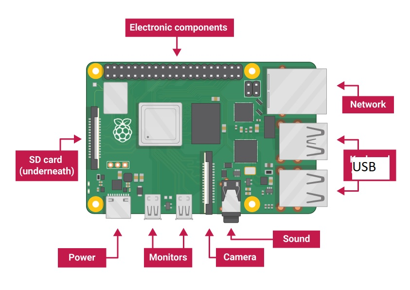

### Les batteries

On utilise cette année des batteries de perceuse (Makita, 18V), sinon des Lipo/Life de hobby king de 12/14V sont très bien.
En terme de consommation électrique, en ordre de grandeur onaà 2/3 A en pic pour les moteurs, et 1/2 A pour le reste.

