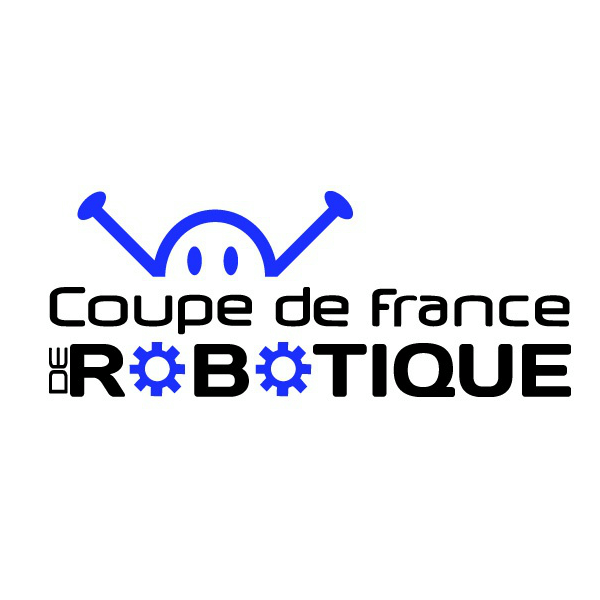
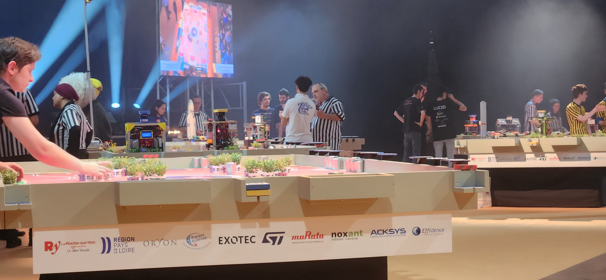
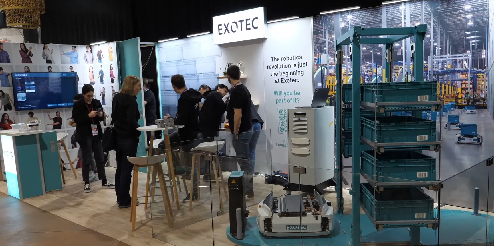

# Activitée Principale

Chaque année, nous participons à la [Coupe de france de robotique](https://www.coupederobotique.fr/), organisée par Planète Sciences. Cette compétition rassemble tous les ans plus d’une centaine d’équipes venus de toute la France, et même du monde pour la coupe d’Europe [Eurobot](https://www.eurobot.org/) qui s’y déroule en même temps. L'évènement se tiens à la [Roche sur Yon](https://maps.app.goo.gl/Hom6DXjm2Rnr7Usx8).
Les participants regroupent des étudiants venus d’écoles d’ingénieurs tels que nous, mais aussi d’IUT et des anciens étudiants désireux de participer à nouveau.

Les matchs se déroulent sur une table de 2*3m pendant 100s, contre une autre équipe. Le principe est qu'il y à plusieurs interactions possibles définies par un thème annuel. Chaque action rapporte un certain nombre de points, le but étant de faire le score le plus élevé possible. Tous les robots doivent être autonomes. Cela implique qu’ils doivent disposer de différents capteurs afin de se repérer et repérer les éléments de jeu sur la table.

Il est possible aussi de rejoindre le [Discord](https://discord.gg/tteC3Cp) officiel de la coupe. On peut y discuter avec les organisateur et toutes les équipes. Parfait pour obtenir du support et des retours d'expériences.

L'évènemet est aussi parfait pour rencontrer des entreprises commes ST, Exotec, Continental ect... qui sponsorisent l'évènement et y tiennent des stands. Si vous cherchez un stage ou un emploi par exemple.

