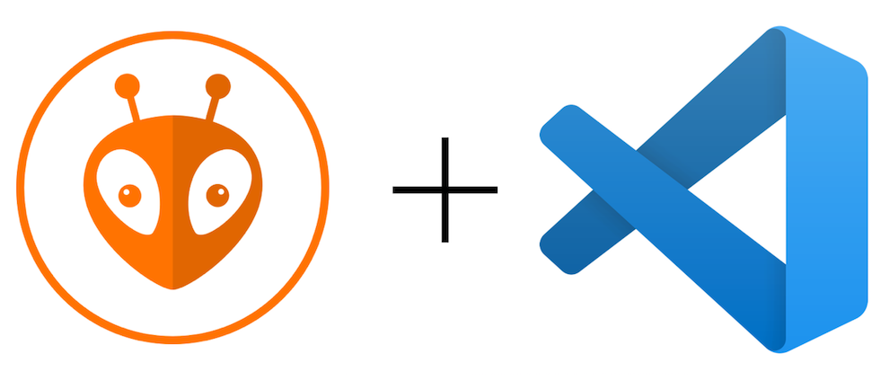

# VS Code

### Editeur de texte (I et II):
L'éditeur à utiliser est visual studio code.
[VS code](https://code.visualstudio.com/). Vous serez amené à l'utiliser aussi en cour alors il sera judicieux de l'avoir sur votre machine personnelle.

Pour installer un ".deb" sur ubuntu par exemple, vous pouvez faire :

`sudo dpkg -i fichier.deb`  

Vous pouvez ensuite installer les extentions C/C++ et Python directement depuis VS code. Ça vous facilitera la lecture des différents codes ainsi que l'auto complétion.

### Outil de compilation pour l'embarqué (II):
Une extension de VS code qui permet de compiler vers les microcontrolleurs
[platformio](https://platformio.org/install/ide?install=vscode).

Vous apprendrez à l'utiliser directement au club lorsque vous aborderez le C++.

[What is Platformio ?](http://ajaugust.com/platformio-notes.html) 

