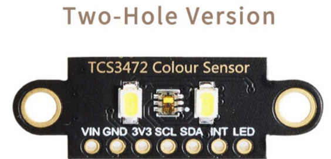

# Code (C, C++)

## capteurs

### TCS 3472(5) :

La librairie Adafruit TCS34725 a une erreur, le mauvais ID du capteur est utilisé (devrait être 0x4D) dans ADAfruit_TCS34725.cpp -> Adafruit_TCS34725::begin
 -> remplacer  if ((x != 0x44) && (x != 0x10)) {
par (x != 0x44) && (x != 0x4D)

Risque de perturbation si autre source de lumière (blanche) forte et proche du capteur
Distance idéal <1cm au pifométre
