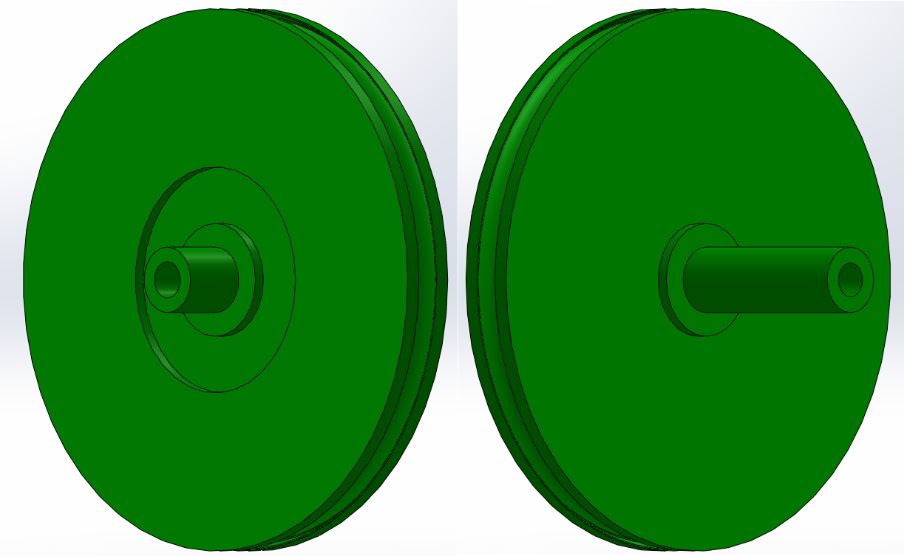

# Mécanique

## Conception générale
### Choix des matériaux

#### Bois

Pas mal, mais contreplaqué de 5mm trop fin et pas assez résistant ?

verre acrylique, Impression 3D, métal

## Base roulante

### Motorisation

Holonome (x3 ou x4 ?), différentiel

### Encodeurs

### roues folles/codeuses

Composition :
+ Encodeur AMT-102V
+ joint torique
+ Impression 3D
+ roulement à bille d16 m3
+ rail de guidage
+ (Ressort)

+ Les designs étaient assez compacts et évitaient de prendre trop de place sur le robot.
+ Impression 3D à éviter car trop fragile, la roue se voile assez vite.
+ Le rail utilisé étant de mauvaise qualité, on a des mouvements possibles perpendiculairement à l’axe de la roue, ce qui est totalement à éviter, et peut grandement diminuer la précision. Solutions possibles -> meilleur rail de guidage, ou mettre 2 rails
+ La rainure n’était pas assez profonde, le joint torique à tendance à se barrer avec le ressort même dans des conditions normales(on a dû mettre de la colle entre la roue et le joint).

+ Il faudrait plutôt faire usiner en aluminium  la roue sur laquelle mettre le joint torique, ou acheter des roues codeuses déjà faites, ça peut coûter ~40€ la roue mais ça vaudrait le cout.