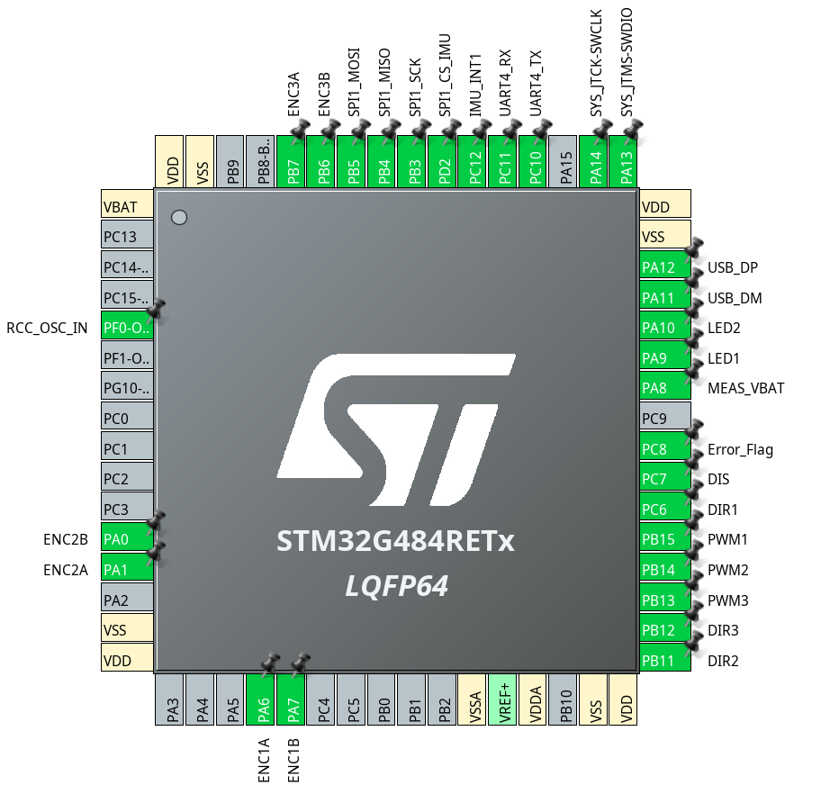
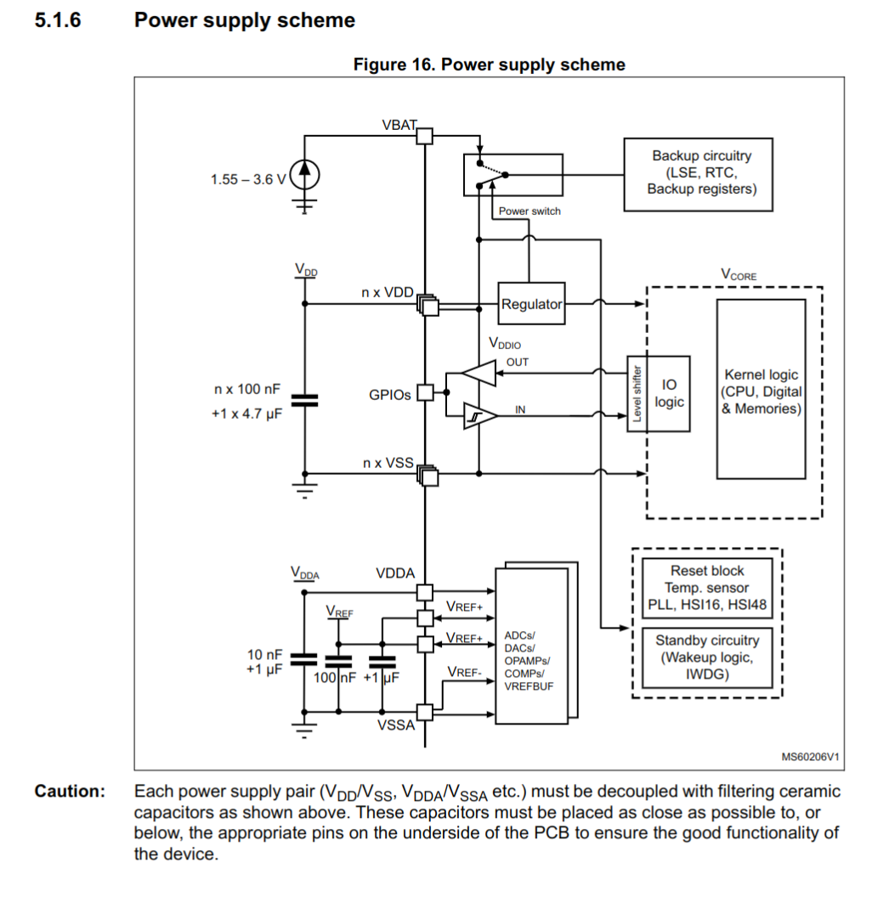
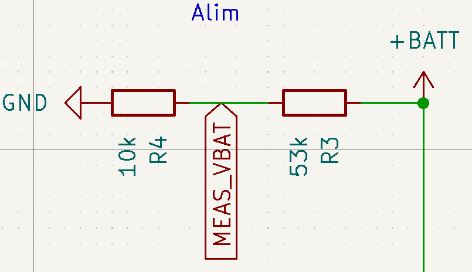
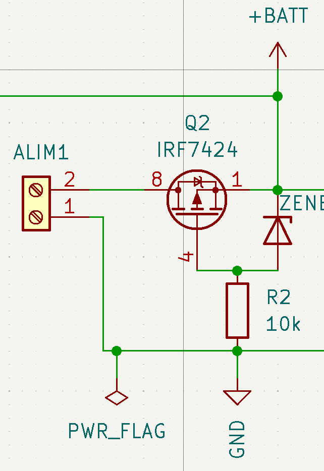

# Carte Base 2024

Cette section vise à montrer et expliquer la conception de la carte pour simplement la comprendre. Elle sert aussi de support pour guider quelqu'un dans la conception d'une carte similaire.

Petit visuel sur la carte:

## Utilisation

## Conception

Bien évidemment il faut d'abord commencer par la schématique fonctionelle de nos composants. En les choisissant soigneusement et en vérifiant toutes leurs dépendances.

Ensuite on procède à un placement préliminaire des composants en essayant d'imaginer les routages qui seront nécéssaires. On essaie de faire le moins de croisement possible et si nécéssaire on modifie l'affectation des pins de la schématique.

Enfin on s'occupe du routage. On fait attention à l'utilisation des grilles et on travaille en système métrique.

#### Microcontrolleur (µC):

Sur les cartes de développement on précise génréalement dans les datasheets sur quelle pin se trouvent les fonctions et où elles se situent sur la carte. Ici, c'est à nous de les placer. En partant du microcontolleur et en les routant ailleurs sur la carte à notre bon vouloir.

Un outil confortable pour cela est cube MX. Il permet de visualiser (et configurer mais on ne le fera pas ici) la puce ou même les cartes de dévelopement. Vous trouverez ci-dessous la configuration choisie des broches du µC. Elle à été faite itérativement. Tout d'abord chercher les broches qui ont les fonctions qui nous intéressent et essayer de les mettre du coté où elles seront routées. Au moment de les placer physiquement sur la carte on peut itérativement chercher la meilleur configuration.

Comme décrit dans la section 5.1.6 de la datasheet du g484 il faut penser à ajouter aux alimentations des [capacités de découplage](../../elec/notions.md) pour permettre son bon fonctionnement.

#### Mesure du niveau de batterie

Il suffit d'utiliser un pont diviseur de tension où le pont est connecté directement à une broche du microcontrôleur. En pratique la batterie étant très durable on ne s'en est pas beaucoup servi. ( Mais on s'en est beaucoup servi sur les PAMI !)

#### Protection de polarité inversé

+ Gestion de puissance
+ Driver
+ Connectiques
 
+ Imu

## Problèmes rencontrés

Pour une raison encore non comprises, il arrive que la carte subisses de chutes de tension. Par conséquent le microcontrôleur redémarre et cela fait complètement planter le robot en condition de match. La solution de contournement trouvé en attendant est de brancher l'USB pour avoir un maintien de la tension du microcontrôleur afin qu'il supporte ces chutes de tension.

## Composants :
La plupart sont disponibles sur [RS](https://fr.rs-online.com/web/)
- [Microcontrôleur STM32G484RET](../../datasheets/stm32g484re-1.pdf)
- [Drivers Moteur IFX9201SG](../../datasheets/Infineon-IFX9201SG-DS-v01_01-EN.pdf)
- [IMU LSM6DSL](../../datasheets/lsm6dsl.pdf)
- Régulateur 5V- 3.3V : LM3940IMP-3.3
- [Régulateur R-78E5.0-1.0](../../datasheets/R-78E-1.0.pdf)
- [Transistor MOSFET IRF7404](../../datasheets/Infineon-IRF7404-DataSheet-v01_01-EN.pdf)