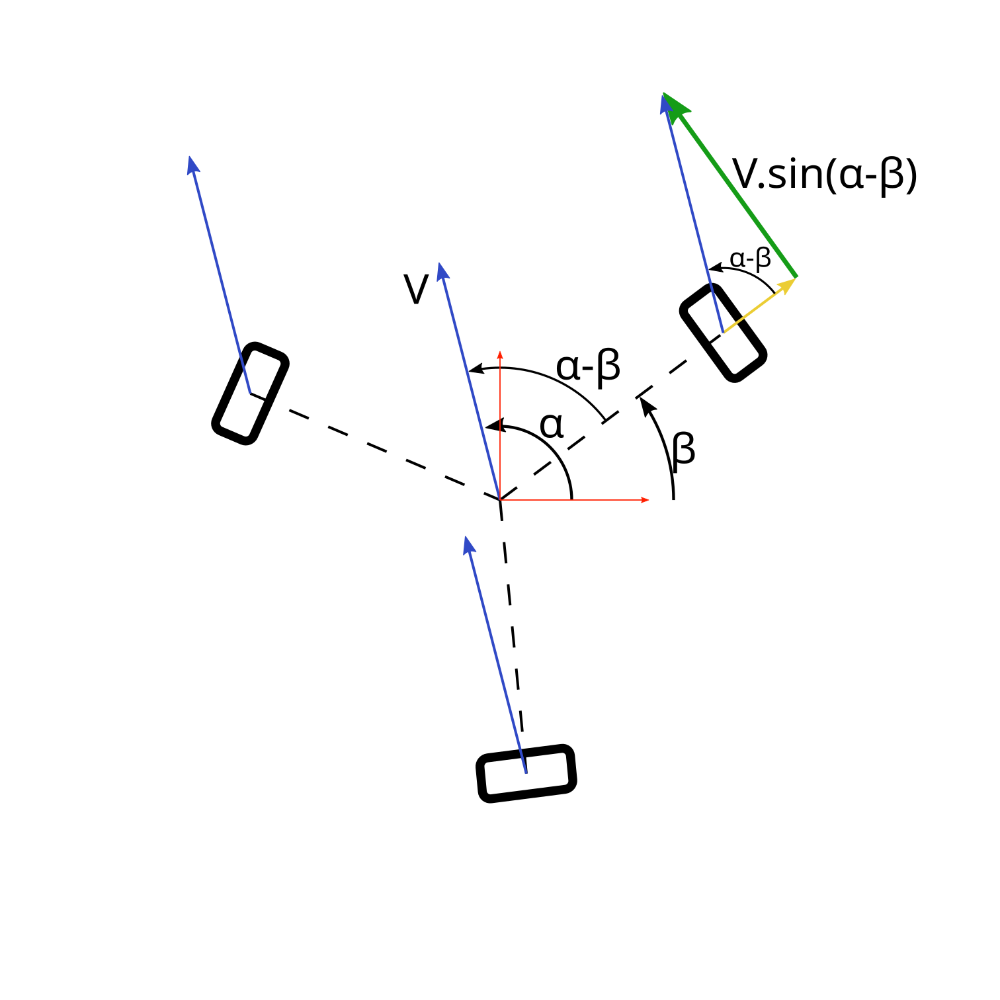

# Base holonome

Considérons une roue, les calculs seront identiques pour les autres roues.

## Rotation

Commençons par le plus simple : la rotation du robot sur lui-même. Le robot doit simplement faire tourner ses roues à la même vitesse.

Les roues sont placées à égale distance \\(R\\) du centre du robot, leurs axes passant par le centre du robot.

Si le robot tourne sur lui-même à une vitesse angulaire \\(\omega\\), la vitesse d'une roue sera donc \\(Vtr = R.\omega\\).

## Translation

La roue est placée à un angle \\(\beta\\) par rapport au repère du robot. Cet angle est fixé par la construction du robot.

Supposons que le robot se déplace en translation pure à une vitesse \\(V\\) qui forme un angle \\(\alpha\\) avec le repère du robot.

La vitesse tangentielle de la roue sera donc de \\(Vtr = V.sin(\alpha-\beta)\\).

La roue étant en translation libre sur l'axe radial, la vitesse radiale peut être ignorée.

## Composition des vitesses, et décomposition selon les axes du robot

Par la composition des vitesses, la vitesse tangentielle totale d'une roue est : \\(Vtr = V.sin(α-β) + R.ꞷ\\)

On connait l'identité trigonométrique : \\(sin(\alpha-\beta) = sin(\alpha).cos(\beta) - cos(\alpha).sin(\beta)\\)

On peut donc écrire

\\[Vtr = V.sin(\alpha).cos(\beta) - V.cos(\alpha).sin(\beta) + R.\omega\\]

Si on décompose la vitesse \\(V\\) du robot selon ses axes, on a :

- \\(Vx = V.cos(\alpha)\\)
- \\(Vy = V.sin(\alpha)\\)

On en déduit donc :

\\[Vtr = Vy.cos(\beta) - Vx.sin(\beta) + R.\omega\\]

## Forme matricielle

Pour 3 roues placées respectivement aux angles \\(\beta1\\), \\(\beta2\\) et \\(\beta3\\), on aura alors :

\\[ \begin{pmatrix}v1\\\\v2\\\\v3\end{pmatrix}=\begin{pmatrix}-sin(\beta1) & cos(\beta1) & R\\\\-sin(\beta2) & cos(\beta2) & R\\\\-sin(\beta3) & cos(\beta3) & R\end{pmatrix}\times\begin{pmatrix}Vx\\\\Vy\\\\\omega\end{pmatrix} \\]

# Cinématique inverse

On a calculé les commandes à donner aux moteurs pour avoir le déplacement désiré. On voudrait maintenant déduire les déplacements du robot des déplacements de chaque moteur.

On avait : \\(m=D.V\\)

La matrice pseudo-inverse de Moore-Penrose \\(D^+\\) permet de résoudre ce problème. On a alors : \\(V=D^+.m\\)

Elle peut être calculée avec numpy avec la fonction `numpy.linalg.pinv`.

## Sources

[Holonomic Control of a robot with an omni-directional drive](https://people.idsia.ch/~alexander/2006/1/omnidrive_kiart_preprint.pdf)
