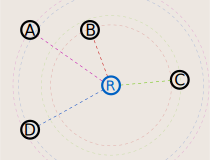

# Localisation UWB (UltraWideBand)

Le but est de déterminer la position du robot en mesurant la différence de temps d'arrivé d'un signal envoyé par le robot à des balises fixes.

Le réglement de la coupe nous autorise à placer en bordure de la table de jeu 4 balises à des positions précises. Voir l'image suivante pour les positions des balises pour chaque équipe.

## Le matériel

Le DWM3001C de Qorvo est un module UltraWideBand avec des [fonctionnalités de ranging](https://en.wikipedia.org/wiki/UWB_ranging) : Il peut mesurer précisément le temps d'arrivé d'un message (ordre de grandeur de 15 picosecondes).

Nous allons placer un module DWM3001C dans chacune des balises fixes, ainsi que sur le robot et la balise embarqué sur le robot adverse afin de les localiser.

## Principe de fonctionnement

1. Le robot envoie un message (_BLINK_).
1. Chacune des balises enregistre le timestamp de réception du _BLINK_, et l'envoie à la balise maître.
1. La balise maître calcule la position du robot par TDOA (Time Difference Of Arrival) : on se base sur la différence de temps d'arrivé du _BLINK_ entre les balises.

Cela implique que les balises fixes doivent être synchronisées entre elles afin de pouvoir comparer les timestamps.

## Synchronisation des balises fixes

La balise maître **A** envoie à intervalles régulier un message de synchronisation (_SYNC_) contenant son timestamp d'envoi.

Soit:
- \\(t_{si}^A\\) : timestamp d'émission du _SYNC_ **i** dans le repère temporel de **A**.
- \\(t_{siB}^B\\) : timestamp de réception du _SYNC_ **i** par la balise **B**, dans le repère temporel de **B**.
- \\(\alpha_B\\) : dérive d'horloge de **B** par rapport à **A**.
- \\(\beta_B\\) : offset d'horloge de **B** par rapport à **A**.
- \\(T_{AB}\\) : temps de vol _SYNC_ **A** et **B**.

On a :

\\[
    t_{siB}^B = \\alpha_B.t_{si}^A + \\beta_B + T_{AB}
\\]

En faisant la différence entre deux _SYNC_ **i** et **j**:

\\[
    \alpha_B = \frac{t_{sjB}^B - t_{siB}^B}{t_{sj}^A - t_{si}^A}
\\]

On déduit de la première équation :

\\[
    \beta_B = t_{sjB}^B - \alpha_B.t_{si}^A - T_{AB}
\\]

Soit:
- \\(t_{rB}^B\\) : timestamp de réception du _BLINK_ du robot par la balise **B**, dans le repère temporel de **B**.
- \\(t_{rB}^A\\) : timestamp de réception du _BLINK_ du robot par la balise **B**, dans le repère temporel de **A**.

On peut écrire :

\\[
    t_{rB}^A = \frac{t_{rB}^B - \beta_B - T_{AB}}{\alpha_B}
\\]

Chaque balise peut donc exprimer le timestamp de réception du _BLINK_ dans le repère temporel de **A**.

## Centralisation des timestamps

Après réception d'un _BLINK_, chaque balise doit envoyer le timestamp (dans le repère temporel de A). Il est important d'attribuer un slot d'émission à chaque balise afin d'éviter les collisions.

Soit :
\\[
    T = \frac{D_{max}}{c} + T_{t}
\\]
La somme du temps de vol maxi entre deux agents, et du temps de traitement d'un message.

- Le robot émet un _BLINK_ à \\(t = t_{sR} + T\\).
- La balise **B** envoie le timestamp à \\(t = t_{sR} + 2.T\\)
- La balise **C** envoie le timestamp à \\(t = t_{sR} + 3.T\\)
- La balise **D** envoie le timestamp à \\(t = t_{sR} + 4.T\\)

La résolution de la position du robot peut ensuite être effectuée par n'importe quelle balise / robot.

## TDoA

[https://dl.cdn-anritsu.com/en-us/test-measurement/files/Application-Notes/Application-Note/11410-01009D.pdf](https://dl.cdn-anritsu.com/en-us/test-measurement/files/Application-Notes/Application-Note/11410-01009D.pdf)
