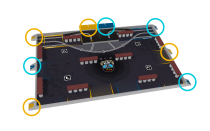
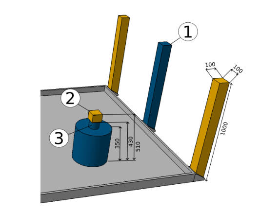
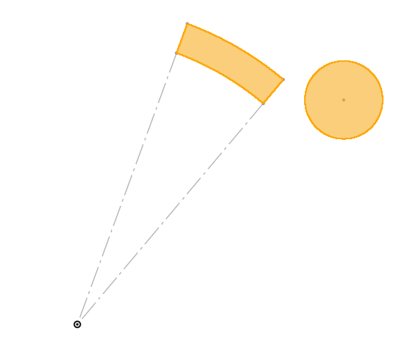

# Localisation LIDAR

Le but est de déterminer la position du robot en repérant des balises placées en bordure de la table de jeu grace à une LIDAR 2D.

Le réglement de la coupe nous autorise à placer en bordure de la table de jeu 4 balises à des positions précises. Voir l'image suivante pour les positions des balises pour chaque équipe.

Ces balises se doivent d'être plus petites qu'un carré en 100x100mm, et de moins d'un mètre de hauteur.

Nous avons choisi d'utiliser des balises circulaires de 100mm de diamètre afin de maximiser nos chances de les repèrer, et qu'elles fassent la même taille quelque soit l'angle de vue.

Connaissant la position des balises, dans le repère de la table, et leur positions dans le repère du robot, nous pouvons en déduire la transformation permettant de passer du repère table au repère robot. C'est à dire la position de l'orientation du robot dans le repère table.

## Pré-traitement des données

Identifier les balises à partir du nuage de points nécessite un pré-traitement des données :

- Grouper les points du lidar afin de distinguer des "objets"
- Filtrer ces objets afin de ne garder que ceux susceptibles d'être des balises:
    - les objets trop gros ne peuvent pas être des balises (les ballises faisant 100mm de diamètre)
    - les objets trop loins ne peuvent pas non plus être des balises, la diagonale de la table faisant 3.6m.
- Déterminer la position du centre de la balise, si l'on suppose que cet objet est une balise.

Il faut ensuite identifier les balises parmis les objets restants.

### Position complètement inconnue

Ce cas n'est pas encore implémenté !

Si la position du robot est complètement inconnue, on peut tester parmi tous les arrangements de 4 objets parmis tous ceux détectés si leurs positions relative peux correspondre à celles des balises.

Le nombre d'arrangement pouvant être très grand, il peut être intéressant de commencer à identifier des paires de balises potentielles afin d'éliminer rapidement un grand nombre d'objets.

Cette méthode peut demander beaucoup de ressources si le nombre d'objets est grand.

### Position récente connue

On peut raisonnablement supposer que le robot ne peut pas se téléporter.

Si l'on connait une position récente du robot, et connaissant la position des balises, on peut calculer la position théorique des balises dans le repère robot.

On peut alors chercher les balises parmis les objets les plus proches de cette position.

On recherche actuellement les balises dans un rayon de 50cm autour de leur dernière position théorique. 

Il serait plus intéressant de rechercher les balises dans un arc de disque en coordonnées polaire.

Cette méthode nécessite assez peu de calculs.

## Déterminer la position du robot

Une fois les basiles identifiées, on peut calculer le position de l'orientation du robot.

Soit \\(T = \begin{pmatrix}x\\\\y\end{pmatrix}\\), la position du robot dans le repère table,  
et \\(R = \begin{pmatrix}cos(θ) & sin(θ)\\\\-sin(θ) & cos(θ)\end{pmatrix}\\) la matrice de rotation permettant de passer du repère robot au repère table;

Soit \\(P_i = \begin{pmatrix}xi\\\\yi\end{pmatrix}\\) la position de la balise \\(i\\) dans le repère robot, et \\(P_i^* = \begin{pmatrix}xi^\*\\\\yi^\*\end{pmatrix}\\) sa position dans le repère table;

On a pour chaque balise \\(i\\) : \\[ P_i^* = R \times P_i + T \\]

On recherche la position et l'orientation du robot \\((T_x, T_x, θ)\\)  qui permettent de minimiser l'erreur entre la position des balises vues par le lidar, et leur position connue.

Dans un cas parfait, cette erreur serait nulle, cepdendant les incertitudes des mesures lidar et les tolérances de la tables font qu'il existera toujours une erreur. On ne peut peux donc pas résoudre un système d'équations car celui-ci n'aurait aucune solutions.

On cherche donc à minimiser l'erreur calculée par la méthode des moindres carrés:

\\[ score(T_x, T_x, θ) = \sum_{i=1}^n {\lVert R \times P_i + T - P_i^* \rVert}^2 \\]

On utilise pour cela la fonction [`least_square`](https://docs.scipy.org/doc/scipy/reference/generated/scipy.optimize.least_squares.html) de `scipy`.

Notons \\(X = (T_x, T_x, θ)\\)

Arguments:

- **`fun`**: Une fonction qui prennant en paramètre le vecteur \\(X\\) évalué, ainsi que des arguments donnés lors de l'appel à `least_square`.  
  La fonction retourne le vecteur des résidus, c'est à dire les éléments individuels permettant de calculer le score vu précédemment.  
  Il faut donc retourner un vecteur contenant les différences de position en X et Y de chauqe balises.
- **`x0`**: La initiale de X. On peut prendre la dernière position connue du robot.
- ~~**`jac`**: La matrice des dérivées partielles.~~ (ça marche mieux sans ça, curieusement)
- **`method`**: `'lm`. 

La fonction retroune alors un `OptimizeResult`, contenant la solution \\(X = (T_x, T_x, θ)\\) de l'optimisation, ainsi que le score de cette solution.

Cette nouvelle position calculée du robot pourra être réutilisée à la prochaine itération comme dernière position connue du robot, et la boucle est bouclée !

