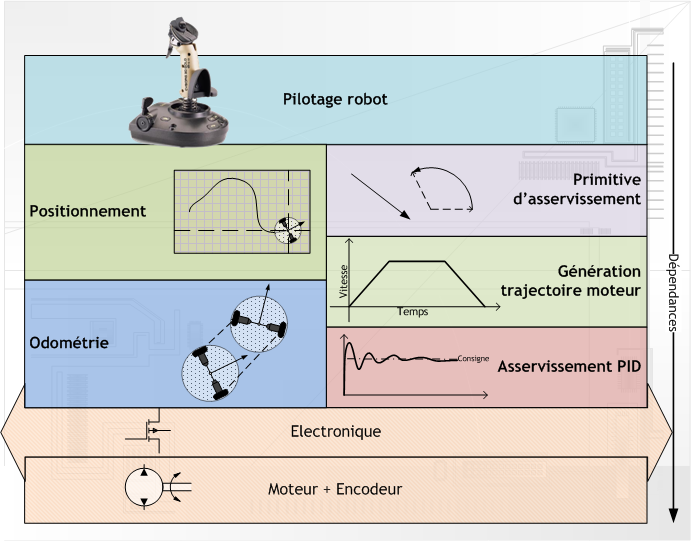
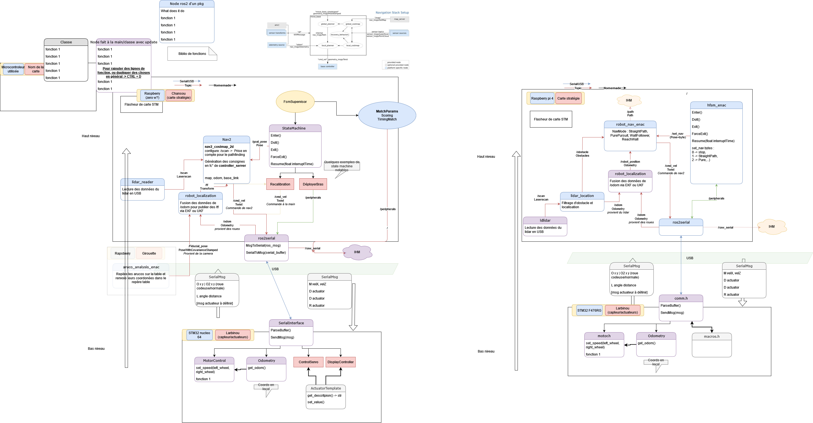

# Tutos code - architecture

## Introduction au code robot

**Pré-requis : Bases du python** (fonctions, classes, boucles, ...)**, Git**

Voici les outils "principaux" qu'on peut retrouver dans tout le code d'un robot, et avoir une notion de base sur chacune des choses peut-être utile.

### Le déplacement du robot / Asservissement

Voir [Asservissement - REX, et en particulier le tuto de PM robotix](../rex/asserv.md).

Photo volé du tuto de PM robotix :

### Capteurs/Actuateurs
### State machine

### Communication inter-programmes

#### Liaison série

#### Topics, Publisher, Subscriber - exemple eCAL
### Simulateur python - eCAL

Utilisable pour tester des (recherches de chemins, Pure pursuit, )

### Visualisation des données

Le code du robot est assez complexe, voici un schéma récapitulant globalement son fonctionnement :

(Exemple mi 2022, pas très clair) :

Le principe est de découpler certaines parties du robot : ...